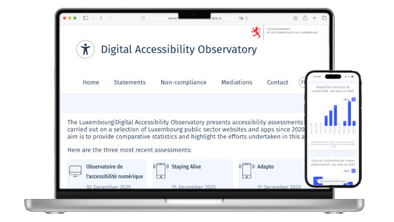

<hgroup> 
<h1>Digitale Barrierefreiheit bekommt ein eigenes Observatorium</h1> 

Wir freuen uns, Ihnen die neueste Website vorstellen zu können, die vom Informations- und Pressedienst entworfen und verwaltet wird: das Digital Accessibility Observatory, dessen Ziel es ist, Ihnen die neuesten Daten zur Barrierefreiheit bereitzustellen, die regelmäßig aktualisiert werden.

</hgroup>

<figure role="group" aria-label="Foto von Lacheev auf iStock" class="pic"> 
 
<figcaption>Foto von <a href="https://www.istockphoto.com/portfolio/Lacheev?mediatype=photography">Lacheev</a> auf <a href="https://www.istockphoto.com/photo/young-man-office-employee-looking-at-laptop-screen-through-binocular-studio-shot-gm2248436528-662284529">iStock</a> 
</figcaption>
</figure>

Eine jährliche Zusammenfassung des Stands der digitalen Barrierefreiheit in den öffentlichen Diensten Luxemburgs bietet Ihnen das Digital Accessibility Portal bisher. Es war möglich, noch einen Schritt weiter zu gehen und die seit 2021 gesammelten Daten besser zu nutzen: Dies ist nun geschehen. Seit gestern ist das [Digital Accessibility Observatory](https://observatoire.accessibilite.public.lu/en/home) online.

Folgendes wird es Ihnen bieten:

- Genaue und vergleichende Daten zu 
- Prüfungen durch den Informations- und Pressedienst (SIP); 
- Erklärungen zur Barrierefreiheit; 
- von SIP durchgeführte Mediationen; 
- und die am häufigsten festgestellten Verstöße.
- Diese Daten werden regelmäßig aktualisiert, und die bereits verfügbaren Daten bieten einen Überblick über die letzten fünf Jahre: Daher ist es leicht zu erkennen, wie sich die Compliance nach Plattform oder Verwaltungsebene entwickelt hat.

Wie das Digital Accessibility Portal ist auch das Observatorium in zwei Sprachen verfügbar: Französisch und Englisch.

## Ein Überblick über die Hauptfunktionen

<figure role="group" class="smallpic"> 

</figure>

### Barrierefreiheitsranking

Das [Barrierefreiheitsranking](https://observatoire.accessibilite.public.lu/en/home#TopWebsites-Title), das als erstes Modul auf der Startseite erscheint, spiegelt die laufenden Bemühungen der öffentlichen Verwaltung zur Förderung der digitalen Barrierefreiheit wider. Es ist einfach, die Ergebnisse von einem Jahr zum nächsten und von einer Plattform zur anderen zu vergleichen.

Vor allem aber richten sich diese Informationen an Menschen mit Behinderungen: Hier finden sie direkt Verweise auf Websites und mobile Apps, von denen sie wissen, dass sie problemlos darauf zugreifen können.

Wenn Sie eine Website oder App auswählen, gelangen Sie zu einer Seite, auf der alle Details des Audits aufgeschlüsselt sind. Besser noch: Wenn diese Website oder App bereits an anderer Stelle geprüft wurde, insbesondere in den vergangenen Jahren, können Sie mit einem einzigen Klick auf diese Informationen zugreifen.

### Verteilung der Compliance-Raten

Diese [„Verteilung der Compliance-Raten“](https://observatoire.accessibilite.public.lu/en/home#Percentiles-Title) Ansicht, die dieselben Daten verwendet, sie aber in Perzentile segmentiert, ist zweifellos am besten geeignet, um Barrierefreiheitstrends seit den ersten Audits im Jahr 2021 zu verfolgen. Auch hier ist es möglich, die in jeder Spalte aufgeführten Websites anzuzeigen und auf die Bewertungsdetails zuzugreifen.

Compliance-Raten nach Verwaltungsebene

Gibt es einen erkennbaren Unterschied zwischen Landes-, Kommunal- und öffentlich-rechtlicher Ebene? Diese Frage beantwortet das Modul ['Konformitätsrate nach Verwaltungsebene'](https://observatoire.accessibilite.public.lu/en/home#AdminLevels-Title), das auch historische Recherchen anbietet.

### Erklärungen zur Barrierefreiheit

[Erklärungen zur Barrierefreiheit](https://accessibilite.public.lu/en/obligations.html#accessibility-statement) sind für Menschen mit Behinderungen unerlässlich und nach dem Gesetz vom 28. Mai 2019 verpflichtend. Dennoch sind sie selten: Kaum eine von zwei Websites verfügt über eine vollständige und aktuelle Erklärung und jede zehnte App (siehe die Seite ['Erklärungen'](https://observatoire.accessibilite.public.lu/en/statements)). Es besteht die Hoffnung, dass diese gesetzliche Verpflichtung schrittweise besser eingehalten wird.

### Nichteinhaltung

Was stimmt mit dem Design oder den redaktionellen Inhalten auf den Seiten einer Website oder auf den Bildschirmen einer mobilen App nicht? Wo liegen die größten digitalen Barrieren? Videos, Seitenstruktur, Formulare, Bilder, Office-Dokumente...: Wo sollte der Schwerpunkt bei der Mitarbeiterschulung liegen? Treten Jahr für Jahr die gleichen Hindernisse auf? Diese Seite ['Nichteinhaltung'](https://observatoire.accessibilite.public.lu/en/conformities) wurde entwickelt, um diese Fragen zu beantworten. Hier sind die Kriterien der Referenzrahmen allesamt zusammengefasst und vereinfacht, Experten können jedoch einem Link zum jeweils relevanten Referenzrahmen folgen.

### Vermittlungen

Ein zentraler Bestandteil einer Erklärung zur Barrierefreiheit ist eine Kontaktadresse für Fragen zur digitalen Barrierefreiheit. Manchmal verläuft der Dialog zwischen Bürgern und Verwaltung nicht zufriedenstellend, weshalb der SIP ebenso wie der Ombudsmann als Vermittler fungiert. Folglich zeigt die Seite [„Vermittlungen“](https://observatoire.accessibilite.public.lu/en/mediations) für jedes Jahr die Anzahl der beim SIP eingereichten Anfragen und parallel dazu die Anzahl der von der Verwaltung bereitgestellten Antworten.

## Barrierefreiheit

Eine der größten Herausforderungen bei der Errichtung dieses Observatoriums war seine Zugänglichkeit. Tatsächlich konzentriert sich diese Website stark auf Datenvisualisierungen, deren Zugänglichkeit relativ komplex ist. Wir haben eine [vollständige Prüfung](https://observatoire.accessibilite.public.lu/en/details_106) der Website gemäß RAWeb durchführen lassen und die Website ist nun vollständig konform.

## Was sind die nächsten Schritte?

Die vom SIP durchgeführten Prüfungen bilden vorerst das Rohmaterial für die Beobachtungsstelle. Das SIP möchte es jedoch irgendwann für Prüfungen durch andere öffentliche Verwaltungen in Luxemburg öffnen. Dies bietet die Möglichkeit für zusätzliche, bereicherte und regelmäßig aktualisierte Informationen.

Diese Plattform wird sich natürlich weiterentwickeln. Wenn Sie Feedback oder Wünsche zu diesem Thema haben, zögern Sie bitte nicht, uns zu [kontaktieren](/de/contact.html).

Dieses vom [Ministerium für Digitalisierung (EN)](https://mindigital.gouvernement.lu/en.html) unterstützte und finanzierte Projekt wurde dank des Programms [Tech-in-Gov (EN)](https://mindigital.gouvernement.lu/en/dossiers/2024/tech-in-gov/projets-tech.html) ermöglicht.