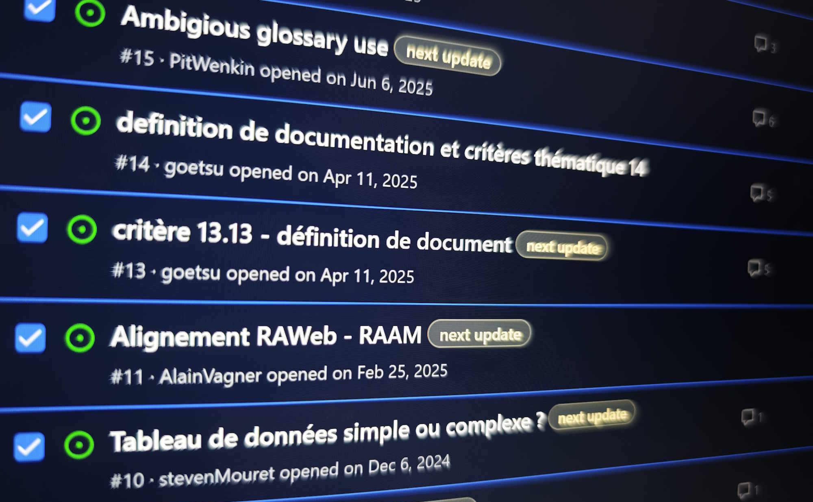

<hgroup> 
<h1>Barrierefreiheits-Frameworks: Frühjahrsputz vor dem großen Facelift</h1> 

2026 wird ein entscheidendes Jahr für unsere Rahmenwerke zur Barrierefreiheitsbewertung sein. Die Überarbeitung zu Beginn dieses Jahres ebnet den Weg für eine umfangreichere Aktualisierung, die die Aktualisierung auf die europäische Norm einbeziehen wird.

</hgroup>

<figure role="group" aria-label="Screenshot des GitHub-Repositorys ReferentielAccessibiliteWeb" class="pic"> 
 
<figcaption>Screenshot des GitHub-Repositorys ReferentielAccessibiliteWeb</figcaption>
</figure>

Die Web- und PDF-Barrierefreiheits-Frameworks [RAWeb](https://accessibilite.public.lu/en/raweb1.1/criteres.html) und [RAPDF](https://accessibilite.public.lu/en/rapdf1.1/referentiel-technique.html) werden beide auf Version 1.1 umgestellt. Diese Aktualisierung ist nach ihrer Einführung im Jahr 2024 bzw. 2023 erforderlich.

Das Hauptziel bestand darin, die zahlreichen Kommentare der nach wie vor sehr aktiven Community einzubeziehen. Der Hauptzweck dieser Kommentare besteht darin, die Kriterien, Tests und Methoden konsistenter zu machen, wo Unklarheiten bestehen könnten, aber auch Verweise auf Technologien zu entfernen, die nicht mehr verwendet werden.

Insgesamt hat diese von der Community überprüfte Überarbeitung zu den folgenden Fortschritten geführt:

## Auf der RAWeb-Seite

- Unterstützung des European Accessibility Act (EAA)
- Vereinfachung und Klärung von Unklarheiten
- Aktualisierung veralteter Techniken (z. B. Internet Explorer)
- Aktualisierung der WCAG-Korrespondenzen

Die Arbeit umfasste insgesamt **33 Kriterien** und **26 Glossareinträge** (ohne Arbeiten im Zusammenhang mit der Kartierung).

Alle Änderungen sind im RAWeb 1.1 [Änderungsprotokoll](https://accessibilite.public.lu/en/raweb1.1/notes-revision.html) dokumentiert.

Die Unterstützung der EAA, insbesondere für Kriterien für Videos, ermöglicht die Verwendung dieses Rahmenwerks außerhalb des strengen Rahmens luxemburgischer gemeinfreier Websites.

Darüber hinaus wurden bestimmte Kriterien, Tests, methodische Elemente und Glossarelemente neu geschrieben, um sie nach der Streichung bestimmter Anforderungen zusammenzufassen (z. B. Test 1.2.4) oder zur Verdeutlichung der Bedeutung zu ergänzen (insbesondere [Methoden für Kriterium 3.1](https://accessibilite.public.lu/en/raweb1.1/criteres.html#test-3-1-1)). Es wurden neue Glossarelemente hinzugefügt, beispielsweise [Dokument](https://accessibilite.public.lu/en/raweb1.1/glossaire.html#document), [Cryptic Content](https://accessibilite.public.lu/en/raweb1.1/glossaire.html#cryptic-content) und [Berechnete Rolle](https://accessibilite.public.lu/en/raweb1.1/glossaire.html#computed-role).

## Auf der RAPDF-Seite

- Vereinfachung und Klärung von Unklarheiten
- Entfernung von Screenreader-basierten Tests
- Hinzufügung von PDF/UA-2-Korrespondenzen

Die Arbeit umfasste insgesamt **9 Kriterien** und **4 Glossareinträge** (ohne Arbeiten im Zusammenhang mit der Kartierung).

Alle Änderungen sind im RAPDF 1.1 [Änderungsprotokoll](https://accessibilite.public.lu/en/rapdf1.1/notes-revision.html) dokumentiert.

Die Testmethodik wurde optimiert, sodass für die Bewertung kein Screenreader mehr erforderlich ist. Die Tests basieren nun auf zwei Tools: Acrobat Reader und PDF Accessibility Checker (PAC).

Der technische Rahmen ist daher etwas prägnanter, auch wenn er jetzt für jedes Kriterium eine PDF/UA-2-Zuordnung enthält.

## Warten auf den Hauptgang: EN 301 549 und damit WCAG 2.2

Mit diesen Aktualisierungen können wir Änderungen der europäischen Norm EN 301 549 berücksichtigen, die im Herbst auf die Version 4.1.1 aktualisiert werden soll. Diese Version des Standards beinhaltet unter anderem Version 2.2 von WCAG. Es bietet auch einen viel breiteren Anwendungsbereich und ermöglicht die Bewertung einer [breiten Palette von Waren und Dienstleistungen](https://accessibilite.public.lu/fr/news/2023-02-27-european_accessibility_act.html) (Bankschalter, Fahrkartenautomaten, E-Books usw.), eine Aufgabe, die [OSAPS](https://accessibilite-produits-services.public.lu/en.html) in Luxemburg gewidmet ist.

<aside class="contextbox">
<h2>WCAG 2.2, warum warten?</h2>

WCAG 2.2 wurde am 5. Oktober 2023 veröffentlicht. Seitdem ist viel passiert. Warum also noch ein Jahr warten, bevor es in unsere Frameworks übernommen wird? In Luxemburg, wie in allen EU-Mitgliedstaaten, basiert die Web-Accessibility-Richtlinie, die die Barrierefreiheit öffentlicher Websites regelt, auf der europäischen Norm EN 301 549. Die derzeit gültige Version der Norm ist die im März 2021 veröffentlichte Version 3.2.1, die sich noch auf WCAG 2.1 bezieht, da WCAG 2.2 zu diesem Zeitpunkt noch nicht veröffentlicht war. EN 301 549 v3.2.1 ist eine harmonisierte Norm, alle Mitgliedstaaten haben sich bereit erklärt, sie anzuwenden, und diese Version wurde im Amtsblatt der EU veröffentlicht. Die europaweit einheitlichen Anforderungen ermöglichen die Schaffung eines Binnenmarktes für Unternehmen, die in den Bereichen Web, Mobiltechnologie und Barrierefreiheit tätig sind. Eine über die Anforderungen des aktuellen Standards hinausgehende Umsetzung der Neuerungen von WCAG 2.2 stünde im Widerspruch zum Ziel eines europäischen Binnenmarktes. Wir müssen daher die Veröffentlichung der neuen Version des europäischen Standards im Amtsblatt der EU abwarten, bevor wir uns mit den neuen Funktionen von WCAG 2.2 befassen. Diese Veröffentlichung ist <a href="https://portal.etsi.org/eWPM/index.html#/schedule?WKI_ID=64282">geplant für Oktober</a>.

</aside>

Die Mission des SIP wird sich jedoch weiterhin auf Tools zur Barrierefreiheitsbewertung für das Web, mobile Anwendungen und PDF-Dokumente beschränken. Unsere drei Frameworks – RAWeb, RAAM und RAPDF – werden daher diesen Herbst einer umfassenden Überarbeitung unterzogen. RAWeb 2 und RAAM 2 sollen Anfang Januar 2027 veröffentlicht werden.

Darüber hinaus bleiben wir aufmerksam gegenüber der Community und freuen uns, regelmäßig Ihre Vorschläge zur Verbesserung dieser Frameworks einfließen zu lassen.

<aside class="more"> 
<h2>Lassen Sie uns interagieren</h2> 

Unsere GitHub-Repositories sind die einfachste Möglichkeit, Ihr Feedback zu den Frameworks zur Barrierefreiheitsbewertung mit uns zu teilen. Hier sind die drei Adressen:
 
<ul> 
<li><a href="https://github.com/accessibility-luxembourg/ReferentielAccessibiliteWeb/issues">Probleme: ReferentielAccessibiliteWeb (RAWeb)</a></li> 
<li><a href="https://github.com/accessibility-luxembourg/ReferentielAccessibiliteMobile/issues">Probleme: ReferentielAccessibiliteMobile (RAAM)</a></li> 
<li><a href="https://github.com/accessibility-luxembourg/ReferentielAccessibilitePDF/issues">Probleme: ReferentielAccessibilitePDF (RAPDF)</a></li> 
</ul>
</aside>