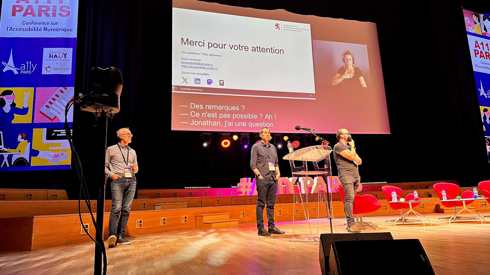

<hgroup>
    <h1>A first for Luxembourg at a11y Paris</h1> 
    
The RAWeb, RAAM and RAPDF frameworks generated clear interest during the event which brought together digital accessibility professionals at the end of June.

</hgroup>

 
    
In just a few years, it has become one of the essential events for digital accessibility professionals: a11y Paris is indeed bringing together more and more people and the 2024 edition, organized at the Maison de la Radio, did not deny this trend. The Open Data and Access to Information division of the Information and Press Service (SIP) was therefore proud to be able to present its work on the stage of studio 104, in particular its three reference frameworks dedicated to the evaluation of web, mobile and PDF accessibility.

<figure role="group" aria-label="Photo: © Sophie Drouvoy 2024" class="pic"> 
     
    <figcaption>Photo: © Sophie Drouvroy 2024</figcaption>
</figure>

This presentation, which we invite you to <a href="https://accessibilite.public.lu/docs/a11yparis2024/">find online</a> (PDF from the projected PowerPoint document and verbatim of our communication; the video should follow by the autumn), was also an opportunity to say who we were, what we represent in Luxembourg and in which international working groups we are involved.

In front of this assembly mainly made up of accessibility professionals, our ambition was to share the work that has come to fruition around RAWeb and RAAM, two open source reference frameworks that fully cover <a href="https://www.etsi.org/deliver/etsi_en/301500_301599/301549/03.02.01_60/en_301549v030201p.pdf">the European standard EN 301 549</a> and offer, like the French General Reference Framework for Improving Accessibility (RGAA), a breakdown into topics, criteria, tests and methodologies. RAWeb is also compatible with the RGAA, from which it takes and enriches the list of 106 criteria. The SIP is doing everything possible to ensure this compatibility during the next updates of the RGAA.

This reference framework is one of the attempts to democratize a standard that is still considered opaque and sometimes difficult to interpret. Other countries are also getting involved, even outside the European Union. For example, Canada published <a href="https://a11y.canada.ca/en/technical-summary-of-the-en-301-549-v321-2021/">a summary of the standard</a> at the end of May. This document can be an introduction for anyone who wants to dive right in.

As for RAAM, it is a mobile app auditing tool that has few equivalents in the world, and whose popularity has been growing in Europe since its publication in 2021. This is one of the reasons that is pushing us today to translate this framework, like RAWeb and RAPDF, into English by early 2025.

The presentation of the SIP left no one indifferent, as evidenced by the marked interest and the many questions from the public. We would like to warmly thank all those who congratulated us and encouraged us to continue on the path we have begun to trace.

In addition to the SIP representatives, Luxembourg also had two digital accessibility specialists within the CTIE, as well as the coordinator of the new Office for Monitoring the Accessibility of Products and Services (OSAPS), which will take office next year. OSAPS is preparing a major event at the Chamber of Commerce entitled "  <a href="https://www.cc.lu/agenda/detail/conference-entreprises-et-accessibilite">Business and Accessibility</a>  " for 23 September.

<a href="https://www.a11yparis.org/2024.php">The a11y Paris 2024 edition</a> was held on June 25 and 26 and offered thirteen conferences, two round tables and ten workshops centered around digital accessibility, its respect and the steps to achieve compliance, but also modes of use, the concept of design system, the consideration of "dys" conditions or the integration of clear language into editorial content. A wide, rich, exciting range of topics, which already invites us to wait for the 2025 edition.

<aside class="more"> <h2>On the same subject</h2> <ul> <li>
<a href="https://accessibilite.public.lu/fr/news/2024-02-08-RAWeb.html">RAWeb, a framework that really includes everything</a>
</li> <li>
<a href="https://www.temesis.com/blog/a11y-paris-2024-nos-temps-forts/">“a11y Paris 2024: our highlights”, on the Temesis blog</a>
</li> <li>
<a href="https://frontguys.fr/accessibilite/a11y-paris-2024-evenement-incontournable-accessibilite-numerique/">“A11Y Paris 2024: A look back at the unmissable digital accessibility event”, on the Frontguys blog</a>
</li> <li>
<a href="https://access42.net/a11y-paris-2024-compte-rendu/">“A11y Paris 2024: our report” on the Access42 blog</a>
</li> </ul>
</aside>