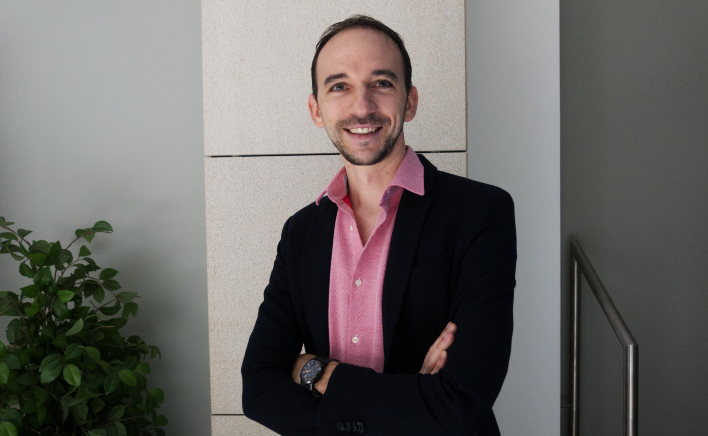

---
tags:
- interview
auteur: Dominique Nauroy
---
<hgroup> 
    <h1>Accessibility at the heart of the CTIE Web&amp;UX service</h1> 
    
Nicolas Ambroise, digital accessibility expert at the State Information Technology Center (CTIE), lifts the veil on how digital accessibility is experienced on a daily basis in the Web&amp;UX service.

</hgroup>

 
    
How does the Web&amp;UX department support its clients to ensure better accessibility? What are the major challenges ahead? Do UX and accessibility go well together? Nicolas Ambroise took part in the Q&amp;A game.

<figure role="group" aria-label="Nicolas Ambroise. Photo: Dominique Nauroy" class="pic"> 
     
    <figcaption>Nicolas Ambroise. Photo: Dominique Nauroy</figcaption>
</figure>
<h2>What led you to become interested in accessibility?</h2>

I started my career in Luxembourg in 2011 after studying at an engineering school in Nancy.

After ten years in mobile and web development, I joined the CTIE. For the past two years, I have been the digital accessibility referent for the CTIE's Web&amp;UX (User experience) department. My main mission is to advise teams in order to improve the accessibility of websites and applications developed by the State.

Unlike most people who embark on this path, it was not the presence of disabled people in my entourage that pushed me into this field. A perfectionist, I want to improve the quality of websites and applications through best practices: not only in terms of accessibility, but also in terms of SEO, security, performance optimization, standardization, etc.

The accessibility aspect is what allows me to be of the greatest service to users because what is beneficial for people with disabilities is beneficial to everyone.

<h2>Concretely, what does this Web&amp;UX service do?</h2>

It is made up of around twenty people with varied profiles (project manager, UX &amp; UI designer, front-end developer, back-end developer, accessibility expert). It is responsible for the technical and graphic creation of state websites as well as their maintenance. The portfolio contains more than 250 sites (thematic portals *.public.lu excluding MyGuichet.lu, sites of ministries and administrations *.gouvernement.lu, embassy sites *.mae.lu). The content is developed by the clients themselves.

<h2>At CTIE and beyond, which allies support you in carrying forward the cause of digital accessibility?</h2>

Overall, the CTIE teams are aware and are increasingly able to anticipate and thus avoid simple or recurring problems.

CTIE conducts its own accessibility audits, which allows us to have an objective assessment of our own work. The findings and advice help us to constantly improve the websites.

The information and press service (SIP) is the body responsible for monitoring the accessibility of sites. It works on the accessibility standards used in Luxembourg, such as RAWeb.

INAP helps us to provide training to raise awareness among editors on this topic. We must be aware that the accessibility of a site does not only mean accessible HTML code but also accessible content (texts, media, etc.).

Finally, let us mention the Office for Monitoring the Accessibility of Products and Services (OSAPS), which was recently created. It must guide and, where appropriate, sanction companies in their process of improving accessibility. It is an actor who contributes to raising awareness of accessibility issues in Luxembourg, but it is not directly linked to our activity.

<h2>How does the day-to-day work with developers go?</h2>

My goal is to advise and detect accessibility issues as early as possible in the process of creating or redesigning sites. For example, it is possible to detect a contrast problem as early as the mockup stage.

After each creation or redesign of a site, an audit is carried out to check accessibility. Following the audit, a reflection phase with the developers allows the best solution to be chosen to correct the problems reported.

<h2>Is the accessibility of sites and apps tending to improve?</h2>

Since the <a href="https://legilux.public.lu/eli/etat/leg/loi/2019/05/28/a373/jo">law of May 28, 2019 relating to the accessibility of websites and mobile applications of public sector organizations</a>, the subject has gained visibility. The CTIE teams are increasingly receptive, aware and the questions I am asked are becoming more relevant.

Accessibility audits report constantly increasing compliance rates. These results, <a href="https://accessibilite.public.lu/fr/news/2024-01-22-rapport2023.html">published annually by the SIP</a>, encourage other partners to follow this growth.

<h2>How does CTIE support its clients, particularly editors, to ensure that new content is accessible?</h2>

The Web&amp;UX service provides customers with a content editing platform (Content management system, CMS) that allows them to achieve a very high RAWeb 1 compliance rate. However, editors who enter content must be trained to be vigilant so as not to lower this rate.

We provide training and support to editors on accessibility issues. We are currently working on creating video tutorials for editors to raise their awareness of the issues most often observed during accessibility audits on content (presence of alternatives on images, change of language in the text, structure of tables and lists, etc.)

<h2>Do UX and accessibility go well together?</h2>

The two themes are closely linked and a site analysis regularly brings up common observations. The border is quite porous and for the moment there has not yet been any major conflict.

For example, we had a discussion about the notion of mobile first. On the UX side, the desire was to offer a minimum of information in mobile mode and more details in desktop view. On the accessibility side, the need remained to have the same information on desktop as in mobile or zoom mode. This led to compromises such as placing certain content in accordion elements, etc.

The graphic designers who work on our projects are all aware of and trained in accessibility issues (e.g. contrasts). When the client arrives with a model that was created in advance without our advice, this often results in several round trips to adapt it.

<h2>The CTIE is currently setting up a design system, what impact will this have on accessibility?</h2>

This design system, currently in the draft phase, will aim to provide citizens with a qualitative and consistent user experience through the State's online services. It will be primarily intended for the CTIE and service providers under contract with the State.

The design system will also make it possible to streamline collaboration between teams and to gain efficiency and speed in the development of digital projects, thanks to a common baseline. This will contain the ergonomic, graphic and accessibility principles applicable to the State's digital projects.

Unlike most design systems, we have gone for a standardization of components without a graphic charter and without a framework. This will allow the design system to be suitable for a majority of digital projects and to be easily reused.

<h2>What do you see as the major challenges ahead?</h2>

We are working on improving the detection of major accessibility errors when writing content and configuring sites. A browser extension and a bookmarklet are in development. The ideal would be to integrate this module directly into the CMS so that errors are reported when the editor enters, even before the content is published online.

In this vein, it remains essential to guide users to improve the accessibility of their office content (PDF) and their videos.

A final word: being 100% compliant with a standard is not enough to include all users. It is important to keep the human element and collect feedback for all our processes.
