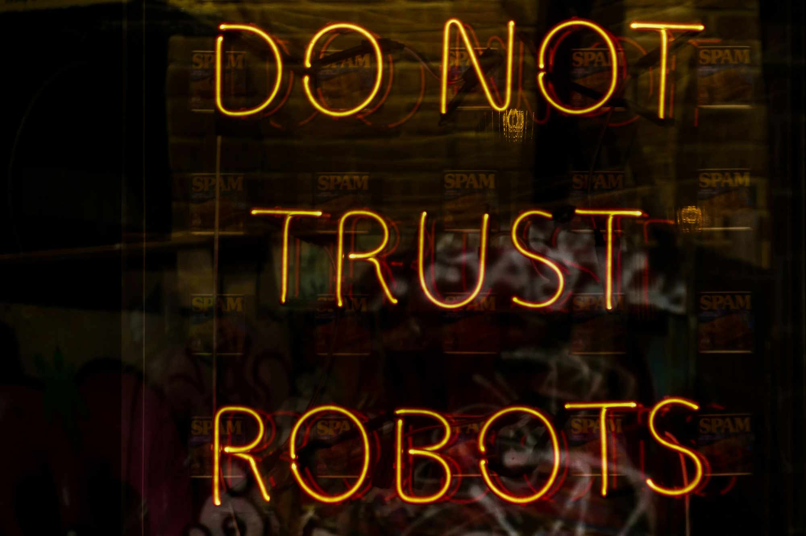
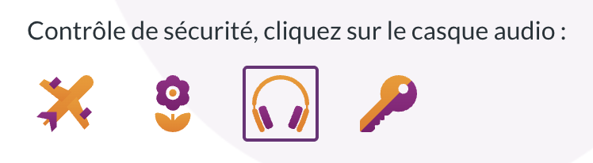
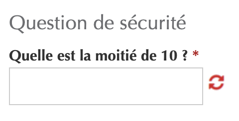

<hgroup>
	<h1>CAPTCHA, when security takes precedence over accessibility</h1>
	
According to the latest WebAIM survey of screen reader users, CAPTCHAs are still the number one accessibility issue for this audience. We take a look at this technology and its impact on accessibility in general and in Luxembourg in particular.

</hgroup>

<figure role="group" aria-label="Photo by Nick Fewings on Unsplash" class="pic">
    
    <figcaption>Photo by <a href="https://unsplash.com/@jannerboy62">Nick Fewings</a> on <a href="https://unsplash.com/photos/texte-C2J92BO3qTw">Unsplash</a>
      </figcaption>
</figure>
<h2>What is a CAPTCHA?</h2>

A <a href="https://en.wikipedia.org/wiki/CAPTCHA">CAPTCHA</a> (Completely Automated Public Turing test to tell Computers and Humans Apart) is a test whose purpose is to differentiate human users from robots.

CAPTCHAs are most often used to prevent:

<ul>
<li>spam on forms that allow users to enter information without authentication;</li>
<li>Website scraping, i.e., the automatic extraction of data from web pages;</li>
<li>Certain brute force attacks (e.g., searching for an account password by rapidly trying a large number of possible passwords).</li>
</ul>

The classic CAPTCHA is a visual test that displays distorted text in an image, and requires the user to copy the contents of this image into a form field. 
This vision-based test is, of course, inaccessible to people with visual impairments unless it is accompanied by an alternative, such as audio (e.g., <a href="https://accessibilite.public.lu/en/raweb1/criteres.html#crit-1-5">RAWeb criterion 1.5</a>).

<figure role="group" aria-label="Example of a visual CAPTCHA (source Wikipedia)" class="smallpic">
    
    <figcaption>Example of a visual CAPTCHA (source Wikipedia)</figcaption>
</figure>

Because this test is particularly vulnerable to advances in AI, it is used less and less frequently, and other types of CAPTCHAs have been developed, such as tests requiring object recognition:

<figure role="group" aria-label="Screenshot of ReCAPTCHA v2" class="smallpic">
    
    <figcaption>Screenshot of ReCAPTCHA v2</figcaption>
</figure>
<h2>CAPTCHA Accessibility: What are the issues?</h2>

According to <a href="https://webaim.org/projects/screenreadersurvey10/#problematic">the latest WebAIM study conducted among screen reader user</a> in 2024, CAPTCHAs remain the number one accessibility issue on the web for blind and visually impaired users. 

Depending on the type of CAPTCHA, they can also be a problem for people who are deaf or hard of hearing (audio CAPTCHA), with motor disabilities (CAPTCHAs requiring fine motor skills to align images), or with cognitive disabilities (calculations, puzzles, etc.). Even in terms of user experience in general, this is problematic because the goal is to solve a technical problem by relying on the user, without providing any compensation.

An increasing number of CAPTCHAs attempt to detect bots transparently, that is, by analyzing browser characteristics and interaction patterns (e.g., mouse movements) to see if they correspond to what is expected of a normal user. This approach can, of course, cause problems, especially if the definition of a "normal" user does not include people with disabilities. A user of assistive technology does not navigate in the same way as a user without assistive technology. For example, screen reader users generally do not use a mouse but a keyboard to navigate the web. The CAPTCHA must therefore handle these cases and avoid discriminating against users based on their disability.

Furthermore, CAPTCHAs are most often located on the critical path of an online process, for example, on a registration form. In this case, an inaccessible CAPTCHA blocks access to the service for an entire category of the population based on their disability.

As is often mentioned, in Luxembourg, this represents 15% of the population, according to <a href="https://statistiques.public.lu/fr/actualites/2024/stn09-handicap.html">the latest STATEC study on the subject</a>.

<h2>CAPTCHAs on Luxembourg public websites</h2>

To better understand the situation on Luxembourg public websites, we conducted a study in September 2025 using our tool capable of detecting 13 CAPTCHA solutions on the market. Out of 821 websites tested, we detected 101 sites that featured a CAPTCHA on at least one page, or approximately one in eight.
Specifically, the following solutions were detected:

<ul>
<li>reCAPTCHA on 98 sites</li>
<li>Friendly Captcha on 2 sites</li>
<li>hCaptcha on 1 site</li>
</ul>

Of course, it is possible that other types of CAPTCHAs are present and have not been detected. We have also manually detected inaccessible CAPTCHAs on other public websites, but this manual search makes it difficult to conduct a study on all pages of public websites known to our services.

<figure role="group" aria-label="Example of an inaccessible visual CAPTCHA detected on a public website" class="smallpic">
    
    <figcaption>Example of an inaccessible visual CAPTCHA detected on a public website</figcaption>
</figure>

You can find <a href="https://data.public.lu/fr/datasets/detection-de-captchas-sur-les-sites-web-du-secteur-public/">the results of this study on data.public.lu</a>.

These CAPTCHAs are mainly present on the websites of municipalities and associations of municipalities (37), and public and related institutions (58). Central government websites (6) are generally spared, which shows that other solutions exist.

The vast majority of the websites on which we detected a CAPTCHA use Google's reCAPTCHA solution. This solution is effective but controversial due to its use of each visitor's personal data and requires consent in Europe to comply with the GDPR.

There are three different versions of reCAPTCHA:

<ul>
<li>v3, which is transparent, meaning it does not require any user interaction;</li>
<li>v2 with a checkbox, which is well-known because it requires object recognition (crossings, fire hydrants, etc.);</li>
<li>v2 invisible, which is similar to v3.</li>
</ul>

We cannot recommend using v2 because, according to the W3C's “<a lang="en" href="https://w3c.github.io/captcha-accessibility/#the-google-recaptcha-v2">Inaccessibility of CAPTCHA</a>” note, it has recently suffered regressions in terms of accessibility, whether in terms of keyboard navigation or audio alternatives.

Since v3 is transparent, it does not pose any accessibility issues in itself. Problems can arise when reCAPTCHA v3 is not certain that the user is human, leaving it up to the site manager to manage this situation, which may lead the site to display a traditional inaccessible CAPTCHA or block the user.

While the transparent CAPTCHA approach is attractive, every website manager must conduct accessibility tests to ensure that users with disabilities are not at risk of being systematically blocked by these devices.

Among the 98 websites using the reCAPTCHA solution, we detected 53 sites featuring an interactive mode with object recognition provided by a v2 of reCAPTCHA. Therefore, currently, more than half of the CAPTCHAs on public sites pose accessibility problems.

<h2>Alternatives to CAPTCHAs</h2>

Many services called CAPTCHA solvers now exist to solve CAPTCHAs for a fee. Some blind people also use the services of certain LLM programs with adequate prompts to solve CAPTCHAs, with a high success rate.

Given the limited effectiveness of CAPTCHAs, depending on the use case, other security measures may be more suitable for protecting your website while limiting the impact on users. For example, this could be a spam filter for a contact form, or a Web Application Firewall to generally protect your website from malicious requests.

The W3C, in its note “<a lang="en" href="https://w3c.github.io/captcha-accessibility/#the-google-recaptcha-v2">Inaccessibility of CAPTCHA</a>”, discusses a whole series of state-of-the-art approaches that can meet these security needs without having the same negative impact on accessibility. Two types of approaches are considered:

<ul>
<li>Interactive approaches, in which the user must perform an action to prove they are human. These approaches include multi-device authentication, somewhat similar to what is done in two-factor authentication on a website, or <a href="https://developers.cloudflare.com/fundamentals/reference/cryptographic-personhood/">cryptographic identity verification</a>, a concept developed by Cloudflare, for example, as an alternative to CAPTCHAs;</li>
<li>Non-interactive approaches, which include most of the transparent CAPTCHAs mentioned above. The W3C note details different approaches (e.g., honeypot, proof-of-work) that can be combined with each other without any user impact.</li>
</ul>

A new family of CAPTCHAs is based on the proof-of-work approach (e.g., <a lang="en" href="https://friendlycaptcha.com/">Friendly Captcha</a>, <a lang="en" href="https://capjs.js.org/">Cap</a>, <a lang="en" href="https://mcaptcha.org/">mCaptcha</a>, etc.) and generally yields good results in terms of both accessibility and privacy. This approach does not require any interaction, although some CAPTCHAs still require you to check a box saying "I'm not a robot." The underlying principle is to have your computer perform difficult cryptographic calculations. For a user, these calculations will take a few seconds. For a robot, if these calculations must be performed regularly, their cost will be prohibitive.

<h2>New requirements, be prepared!</h2>

CAPTCHAs are often implemented on contact forms. Since the entry into force, on June 28, 2025, of the <a href="https://legilux.public.lu/eli/etat/leg/loi/2023/03/08/a133/consolide/20250628">law of March 8, 2023 on the accessibility of products and services</a>, these contact forms can be considered electronic communication services. Under these conditions, an inaccessible CAPTCHA on a contact page could render this service non-compliant and could expose any public or private sector organization to sanctions.

Please do not hesitate to contact the competent oversight body for the accessibility of products and services, <a href="https://accessibilite-produits-services.public.lu/fr.html">OSAPS</a>, if you have any questions about this.

Furthermore, CAPTCHAs that test cognitive functions will no longer be permitted on public sector websites and apps in the next update of the European standard EN 301 549, which will be published in 2026. This standard will include the new WCAG 2.2 success criterion <a href="https://www.w3.org/WAI/WCAG22/Understanding/accessible-authentication-minimum.html">"Accessible Authentication (Minimum)."</a>

The principle behind this criterion is to avoid cognitive tests (puzzles, calculations) that are not accompanied, for example, by an alternative or assistance.

<figure role="group" aria-label="Screenshot of MyGuichet (September 2025)" class="smallpic">
    
    <figcaption>Screenshot of MyGuichet (September 2025)</figcaption>
</figure>

Visual CAPTCHAs that require object recognition are an exception to this criterion. These will, however, require a non-visual alternative.

<h2>In conclusion</h2>

In Luxembourg, approximately one in eight public websites we tested contains a CAPTCHA. More than half of the CAPTCHAs on public websites pose accessibility issues. While some proposed solutions have a low user impact (transparent CAPTCHAs, proof-of-work), it is nevertheless the responsibility of each site manager to ensure that people with disabilities will not be blocked by these devices.

If you think you may need a CAPTCHA, consider using other security systems. If you are certain that CAPTCHAs are the solution to your needs, in this case, prioritize transparent solutions and conduct tests with assistive technologies and possibly with the users concerned to ensure their compatibility.

<aside class="more">
    <h2>To find out more</h2>
    <ul>
        <li><a href="https://w3c.github.io/captcha-accessibility/">Inaccessibility of CAPTCHA, W3C</a></li>
        <li><a href="https://www.w3.org/WAI/WCAG22/Understanding/accessible-authentication-minimum.html">"Accessible authentification (minimum)"</a>, WCAG 2.2</li>
        <li><a href="https://blog.pope.tech/2022/11/08/captcha-challenges-arent-accessible-but-your-website-can-be-accessible-and-secure/">CAPTCHA challenges aren’t accessible, but your website can be accessible and secure, PopeTech</a></li>
        <li><a href="https://a11yboost.com/articles/are-captcha-systems-failing-accessibility">Are CAPTCHA Systems Failing Accessibility?</a></li>
        <li><a href="https://github.com/accessibility-luxembourg/captchaCrawler">captchaCrawler tool from the IPS on GitHub</a></li>
    </ul>
</aside>