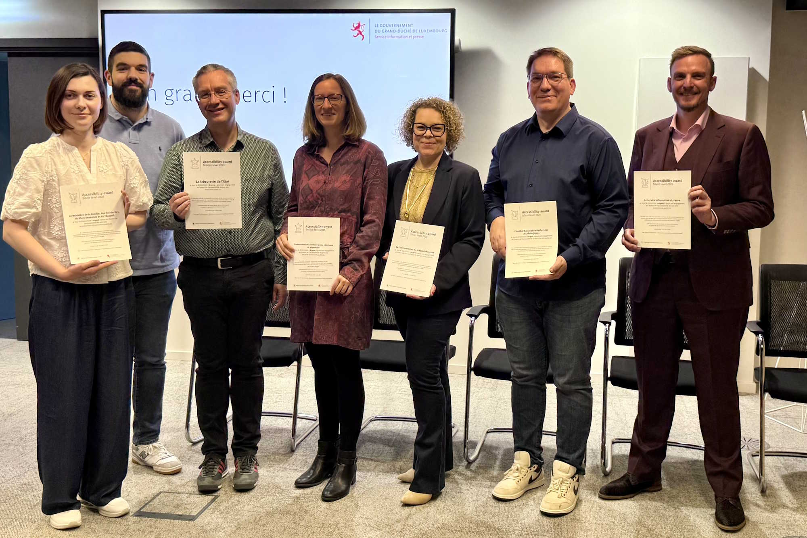
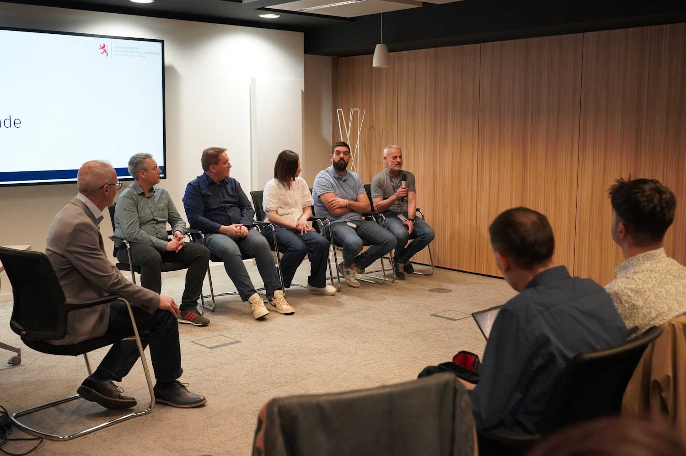
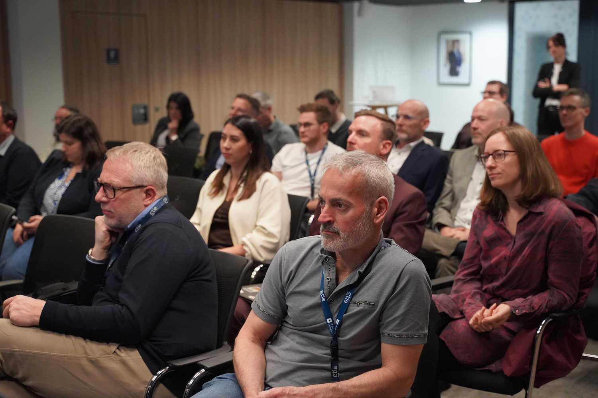

<hgroup>
	<h1>Accessibility Awards: six winners lead the way</h1>
	
On Thursday 23 April, the first Digital Accessibility Awards ceremony took place at the GovTech Lab. This inaugural event also marked the official launch of the Digital Accessibility Observatory.

</hgroup>

<figure role="group" aria-label="From left to right: Chloé Miche and Tiago Gonçalves (accessibilite-infrastructure.public.lu), Luc Nickels (tresorie.public.lu), Miriam Fougeras (securite-alimentaire.public.lu), Anne Grulms (ccss.public.lu), Claude Dessouroux (inra.lu), Sven Knepper (luxembourg.lu). Photo: Rebecca Hemmer, SIP" class="pic">
    
    <figcaption>From left to right: Chloé Miche and Tiago Gonçalves (accessibilite-infrastructure.public.lu), Luc Nickels (tresorie.public.lu), Miriam Fougeras (securite-alimentaire.public.lu), Anne Grulms (ccss.public.lu), Claude Dessouroux (inra.lu), Sven Knepper (luxembourg.lu). Photo: Rebecca Hemmer, SIP</figcaption>
</figure>

For this first edition of the Prix de l’accessibilité numérique, the award was presented to the managers of six internet portals:

- [luxembourg.lu](https://luxembourg.public.lu/fr.html){lang="fr"}, managed by the Information and Press Service (SIP),
- [ccss.lu](https://ccss.public.lu/fr.html), managed by the Centre commun de la sécurité sociale,
- [inra.public.lu](https://inra.public.lu/fr.html){lang="fr"}, managed by the National Institute for Archaeological Research,
- [accessibilite-infrastructure.public.lu](https://accessibilite-infrastructure.public.lu/fr.html){lang="fr"}, managed by the Ministry of Family Affairs,

have been awarded the <strong>‘silver’</strong> status;

- [securite-alimentaire.public.lu](https://securite-alimentaire.public.lu/fr.html){lang="fr"}, managed by the Luxembourg Veterinary and Food Administration,
- [tresorerie.public.lu](https://tresorerie.public.lu/fr.html){lang="fr"}, managed by the State Treasury,

have been awarded the <strong>‘bronze’</strong> status.

Following the award ceremony, a round-table discussion gave representatives from the winning organisations the opportunity to explain their methods in detail and describe how they ensure their editorial content meets digital accessibility criteria.

<figure role="group" aria-label="From left to right: Dominique Nauroy (moderator), Luc Nickels, Claude Dessouroux, Chloé Miche,
Tiago Gonçalves, David Thomas. Photo: Rebecca Hemmer" class="pic">
    
    <figcaption>From left to right: Dominique Nauroy (moderator), Luc Nickels, Claude Dessouroux, Chloé Miche,
Tiago Gonçalves, David Thomas. Photo: Rebecca Hemmer</figcaption>
</figure>

All emphasised the importance of close collaboration with the Government IT Centre (CTIE) to benefit from its expertise in this field.

The CTIE is currently responsible for the development of some 250 public websites, as confirmed by David Thomas, head of the Web UX unit at the CTIE. Digital accessibility is by no means a new initiative, and a process of continuous improvement is in place, with support provided to the CTIE’s clients.

In this frame, participants also praised a design methodology in which accessibility issues are integrated from the outset. 

Among the teams responsible for content creation, there remains strong demand for training, particularly regarding PDF accessibility, which remains a major challenge. It is generally agreed that complex forms also remain a sensitive issue.

<aside class="contextbox">
<h2>Accessibility training: ask for the catalogue!</h2>

The INAP offers several digital accessibility training courses, delivered by the SIP or the CDV, aimed at public sector staff in central and local government.

<ul>
<li><a lang="fr" href="https://fonction-publique.public.lu/fr/formation-developpement/catalogue-formations/secteur-etatique/04devorganis/04-6-egalch/et_0406-1-005BL.html">Initiation à l'accessibilité numérique&#8239;: prise en compte du handicap dans la digitalisation des services</a></li>
<li><a lang="fr" href="https://fonction-publique.public.lu/fr/formation-developpement/catalogue-formations/secteur-etatique/04devorganis/04-6-egalch/et_0406-1-017CV.html">Accessibilité des fichiers bureautiques rendre vos documents Word et PDF accessibles</a></li>
<li lang="de"><a href="https://fonction-publique.public.lu/fr/formation-developpement/catalogue-formations/secteur-etatique/04devorganis/04-6-egalch/et_0406-1-010PR.html">PDF/UA gestalten mit Adobe InDesign</a></li>
</ul>
</aside>

## How can you secure a place on the podium next year?

The [Digital Accessibility Observatory](https://observatoire.accessibilite.public.lu/en/home), which has been available online since late winter, was officially launched at the event at the GovTech Lab. Its homepage now features the winning websites.

<figure role="group" aria-label="This first edition of the Accessibility Awards attracted a large audience on Thursday 23 April. Photo: Rebecca Hemmer, SIP" class="pic">
    
    <figcaption>This first edition of the Accessibility Awards attracted a large audience on Thursday 23 April. Photo: Rebecca Hemmer, SIP</figcaption>
</figure>

How can you maximise your chances of winning an award in 2027? The award criteria are explained <a href="https://observatoire.accessibilite.public.lu/en/labels">here</a>, and these awards are open to public sector websites and apps. 

Accessibility is not a ‘one-off’ task and requires the implementation of processes to ensure a high standard of accessibility. Indeed, accessibility must be considered at an early stage in projects and by all professional groups, whether developers and technical service providers on the one hand, or editorial teams on the other. Teams must, of course, be trained in digital accessibility, and the implementation of regular audits and automated testing helps to ensure that there is no regression. 

## A plan for accessibility and inclusion

The event also provided an opportunity to present the <a href="https://gouvernement.lu/dam-assets/images-documents/actualites/2026/02-fevrier/04-obertin-inclusion-numerique/pdf/plan-daction-national-dinclusion-numerique-2026-2030.pdf">National Action Plan for Digital Inclusion 2026–2030</a>. Ben Max, coordinator of the ‘Promoting Digital Inclusion’ department within the Ministry of Digitalisation, outlined its strategic pillars, aimed at developing:
- In-depth digital skills for everyone;
- Greater confidence in digital services;
- Greater access to digital services;
- Greater autonomy through digital technology;
- An alternative to digital technology, so as not to exclude those who cannot access it.

## From one award to the next

The SIP will take part in the next <a href="https://zesummendigital.public.lu/en/toolbox/actualites/2026/fin-2026.html">Interdisciplinary Forum on Digital Inclusion</a>. The event, organised by the Ministry of Digitalisation, will take place on 20 May. It will bring together experts and stakeholders committed to promoting digital inclusion for all. On this occasion, the 2026 Digital Inclusion Award will be presented by the Minister for Digitalisation, Stéphanie Obertin.