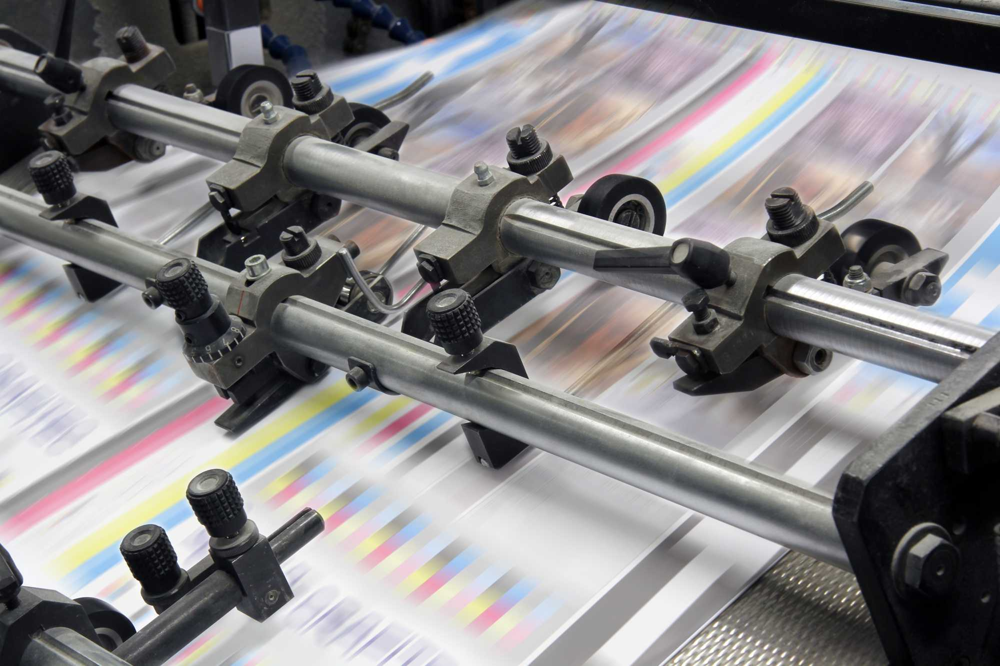
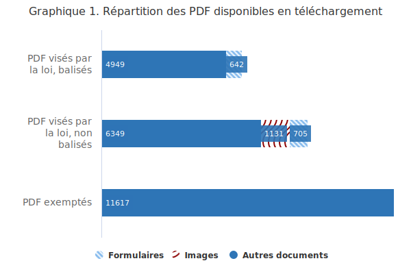
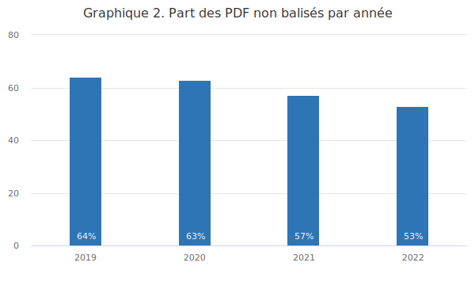
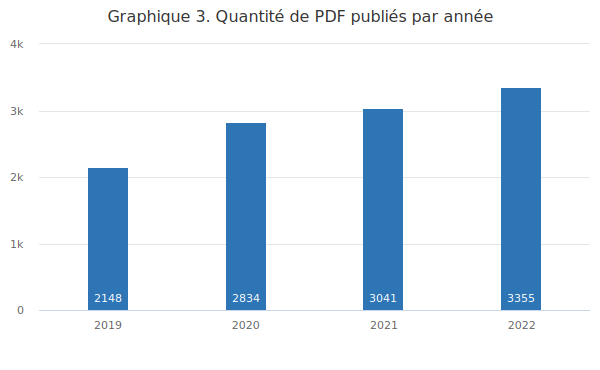
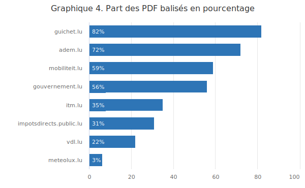
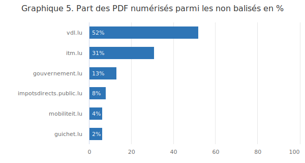

<hgroup>
	<h1>Sur les sites publics les plus visités, des PDF majoritairement inaccessibles</h1>
	
L’accessibilité de ces documents présents parfois massivement sur les portails publics luxembourgeois les plus visités en 2023 tend cependant à s’améliorer

</hgroup>

    
La présence sur les sites publics d’une grande quantité de fichiers PDF non accessibles est un problème clé pour les personnes handicapées. En effet, certains problèmes d’accessibilité peuvent bloquer totalement l’accès à l’information ou la mise en œuvre de procédures administratives dans le cas de formulaires. Nous étudions dans cet article l’accessibilité des PDF présents sur les 17 sites publics luxembourgeois les plus visités.

<figure role="group" aria-label="Photo: Getty Images / istockphoto.com / nyvltart" class="pic">
    
    <figcaption>Photo&#8239;: Getty Images / istockphoto.com / nyvltart</figcaption>
</figure>

Lorsqu’un document PDF est numérisé comme une image ou non balisé, un utilisateur aveugle ou grand malvoyant n’a pas du tout accès à son contenu (pour plus de détails à ce sujet, voir l’article «&#8239;<a href="https://access42.net/pdf-accessibilite?lang=fr">PDF et accessibilité, la fausse bonne idée</a>&#8239;»).

<h2>L’étude</h2>

En avril 2023, le SIP a analysé un échantillon de fichiers PDF issus des 17 sites publics luxembourgeois les plus visités, d’après le <a href="https://github.com/zakird/crux-top-lists">Top 1 Million de Google</a>&#8239;:

<ul>
<li>adem.lu,</li>
<li>cita.lu,</li>
<li>gouvernement.lu,</li>
<li>govjobs.lu,</li>
<li>guichet.lu,</li>
<li>impotsdirects.public.lu,</li>
<li>inll.lu,</li>
<li>inondations.lu,</li>
<li>itm.lu,</li>
<li>lod.lu,</li>
<li>luxembourg.lu,</li>
<li>map.geoportail.lu,</li>
<li>meteolux.lu,</li>
<li>mobiliteit.lu,</li>
<li>petitions.lu,</li>
<li>portal.education.lu,</li>
<li>vdl.lu.</li>
</ul>
<aside class="contextbox">
    <h3>Les trois problèmes d’accessibilité des PDF les plus bloquants</h3>
    <h4>Les PDF non balisés</h4>
    
Le format PDF est à la base un format destiné à l’impression. En 2001, une nouvelle version de ce format a introduit le concept de balisage («&#8239;tagging&#8239;») qui permet de fournir aux technologies d’assistance des informations structurées sur le contenu des pages et ainsi de le rendre accessible aux personnes en situation de handicap. En pratique, le balisage permet aux personnes aveugles d’identifier et d’interagir avec les différents types de contenus comme les titres, les listes, les paragraphes, les tableaux, les images, les champs de formulaires, etc. Les principales suites bureautiques et logiciels de PAO (Publication Assistée par Ordinateur) permettent d’exporter des PDF balisés.

    <h4>Les documents numérisés en mode image</h4>
    
Lorsqu’un document papier est numérisé en mode image et exporté au format PDF, il est nécessaire d’opérer une reconnaissance optique des caractères (en anglais «&#8239;optical character recognition&#8239;» ou OCR). Sans cette étape, le document sera constitué uniquement d’images pour chaque page qui ne seront pas accessibles. La reconnaissance des caractères peut être réalisée via Adobe Acrobat Pro ou via tout logiciel spécialisé dans l’OCR.

    <h4>La protection contre l’utilisation de technologies d’assistance</h4>
    
Le format PDF propose de nombreuses options de protection des documents, par exemple contre la modification. Une de ces options protège le document contre l’utilisation de technologies d’assistance par les personnes handicapées. Cette option peut être activée par erreur et est globalement à proscrire.

</aside>

L’analyse a porté essentiellement sur les trois problèmes d’accessibilité les plus bloquants. Il existe bien entendu de nombreux autres problèmes d’accessibilité potentiels (voir le référentiel d'évaluation de l'accessibilité des documents au format PDF <a href="https://accessibilite.public.lu/fr/rapdf1/">RAPDF</a> pour l’ensemble des critères à respecter pour la production de PDF accessibles) mais le balisage est un prérequis. S’il est absent, un PDF est directement considéré comme non accessible.

<h2>Les résultats</h2>
<h3>Généralités</h3>

Nous avons analysé 25&#8239;398 fichiers PDF représentant un volume de 42 Go et plus de 471 000 pages. Les documents PDF représentent 95&#8239;% des fichiers bureautiques en téléchargement sur les sites analysés. Les 5&#8239;% restants sont essentiellement des documents issus de la suite Microsoft Office.

Sur l’ensemble des documents PDF disponibles en téléchargement, 46&#8239;% sont a priori exemptés de l’obligation d’accessibilité car publiés avant le 23 septembre 2018 (exemption prévue dans <a href="https://legilux.public.lu/eli/etat/leg/loi/2019/05/28/a373/jo">la loi du 28 mai 2019</a>). Dans la suite de cet article, nous considérons uniquement les documents PDF qui sont soumis à l’obligation d’accessibilité, c’est-à-dire les formulaires et les documents publiés après le 23 septembre 2018.

<figure class="chart">
    

        
    

    

        
<h5>Description du graphique 1</h5>

        

            

        

        
Ce diagramme présente, sous forme d'une carte proportionnelle, la répartition des 25&#8239;398 fichiers PDF collectés dans le cadre de cette étude&#8239;:

        <ul>
            <li>13&#8239;781 PDF visés par la loi, dont</li>
            <ul>
                <li>5&#8239;591 balisés</li>
                <ul>
                    <li>642 formulaires</li>
                    <li>4&#8239;949 autres documents structurés</li>
                </ul>
                <li>8&#8239;185 non balisés</li>
                <ul>
                    <li>1&#8239;131 fichiers numérisés en mode image</li>
                    <li>705 formulaires</li>
                    <li>6&#8239;349 autres documents non structurés</li>
                </ul>
            </ul>
            <li>11&#8239;617 PDF exemptés</li>
        </ul>
    

</figure>

Concernant l’accessibilité de ces documents, nous avons détecté que 59&#8239;% sont non balisés. Parmi ces documents non balisés, 9&#8239;% sont des formulaires et 14&#8239;% sont des documents numérisés sur lesquels aucune reconnaissance optique de caractères n’a été réalisée.

Dans une autre perspective, si on étudie l'ensemble des PDF en fonction de leur nature, on constate que 5&#8239;% des documents PDF environ sont des formulaires. Ces documents sont donc particulièrement importants car ils supportent des procédures administratives actives. 52&#8239;% d’entre eux ne sont pas balisés.

Point positif&#8239;: très peu de documents sont protégés contre l’usage de technologies d’assistance (0,03&#8239;%).

<h3>Évolution temporelle</h3>

    <figure class="chart">
        

            
        

        

            
<h5>Description du graphique 2</h5>

            

                

            

            
Ce diagramme en colonnes présente l'évolution sur quatre ans, de 2019 à 2022, de la part des PDF non balisés analysés dans le cadre de cette étude.

        

    </figure>
    <figure class="chart">
        

            
        

        

            
<h5>Description du graphique 3</h5>

            

                

            

            
Ce diagramme en colonnes présente l'évolution sur quatre ans, de 2019 à 2022, de la quantité des PDF publiés dans le cadre de cette étude.

        

    </figure>

En s’appuyant sur la date de dernière modification des fichiers étudiés, on peut identifier des tendances intéressantes sur les quatre dernières années. Si le nombre de documents publiés par année est en augmentation depuis 2019, la part des PDF non balisés est en diminution (de 64&#8239;% en 2019 à 53&#8239;% en 2022).

Si le nombre de PDF non balisés est encore bien trop élevé, notamment pour les formulaires, la tendance générale est à l’amélioration progressive de l’accessibilité des documents en téléchargement.

<h3>Comparatif des principaux sites</h3>
<figure class="chart">
    

        
    

    

        
<h5>Description du graphique 4</h5>

        

            

        

        
Ce diagramme en lignes présente, dans huit sites couverts par l'étude, la part des documents PDF balisés.

    

</figure>

On constate d’importantes disparités entre les sites quant à la part des PDF balisés. Nous avons analysé ici les sites ayant plus d’une centaine de fichiers PDF à disposition. Guichet.lu est en tête de peloton avec 82&#8239;% et meteolux.lu ferme la marche à seulement 3&#8239;%.

Ces résultats sont néanmoins à nuancer, car nos tests automatiques ne permettent pas de savoir si les documents considérés sont exempts de l’obligation de conformité avec les normes d’accessibilité. En effet un document peut être émis par un tiers et ne pas être sous le contrôle de l’organisme qui publie, ou bien une alternative accessible peut être présente. Ces deux exceptions sont prévues dans la loi.

<h3>Impact du mode de production</h3>

Nous avons ensuite voulu connaitre l’origine des fichiers balisés et non balisés. Fort heureusement le format PDF dispose de métadonnées «&#8239;Creator&#8239;» et «&#8239;Producer&#8239;» qui permettent d’identifier la provenance.

Vous trouverez ci-dessous les Top 5 des logiciels et matériels que nos tests ont pu identifier et qui ont produit le plus de documents balisés et non balisés&#8239;:

<h4>Top 5 des producteurs de PDF balisés</h4>
<ol>
<li>
Microsoft Word
</li>
<li>
Adobe Acrobat PDFMaker
</li>
<li>
Adobe InDesign
</li>
<li>
Adobe LiveCycle Designer
</li>
<li>
Microsoft Powerpoint
</li>
</ol>
<h4>Top 5 des producteurs de PDF non balisés</h4>
<ol>
<li>
Adobe InDesign
</li>
<li>
Konica Minolta
</li>
<li>
Pscript5.dll (Acrobat Distiller / GhostScript)
</li>
<li>
Microsoft Print to PDF
</li>
<li>
Adobe Acrobat
</li>
</ol>

On note tout de même une part importante (35&#8239;%) des fichiers dont on n’a pu identifier l’origine via leurs métadonnées.

Les principaux producteurs de PDF non balisés sont le logiciel de PAO InDesign, des scanners et la fonctionnalité d’impression en PDF incluse dans la plupart des systèmes d’exploitation récents.

<figure class="chart">
    

        
    

    

        
<h6>Description du graphique 5</h6>

        

            

        

        
Ce diagramme en lignes présente, dans six sites couverts par l'étude, la part des documents PDF numérisés en mode image parmi les non balisés, en pourcentage.

    

</figure>

La prévalence de documents numérisés en images sur les sites publics est variée. Leur nombre est très faible sur un site comme guichet.lu (2&#8239;% des PDF non balisés sur ce site) mais très important sur celui de la Ville de Luxembourg (52&#8239;% des PDF non balisés du site).

<h3>Analyse des déclarations d’accessibilité</h3>

Tout site public est soumis à l’obligation de publier une déclaration d’accessibilité. Celle-ci est généralement disponible via un lien «&#8239;Accessibilité&#8239;» présent dans le footer de chaque page. Les organismes en charge de ces sites doivent y décrire le niveau d’accessibilité atteint ainsi que les problèmes d’accessibilité dont l’organisme a connaissance. Nous avons cherché à savoir si ces organismes ont conscience des problèmes d’accessibilité éventuels des fichiers PDF qu’ils publient.

11 sites sur les 17 étudiés disposent d’une déclaration d’accessibilité. Parmi ceux-ci&#8239;:

<ul>
<li>8 invoquent une exemption prévue par la loi pour les documents anciens (4) ou pour les documents provenant de tiers (7).</li>
<li>7 invoquent une exemption pour charge disproportionnée&#8239;: les travaux de mise en conformité de leurs documents PDF seraient trop coûteux par rapport au bénéfice estimé pour les citoyens.</li>
<li>3 mentionnent les PDF comme une non-conformité qui sera corrigée.</li>
</ul>

<strong>Aucune de ces déclarations ne permet d’identifier de manière précise quels PDFs sur leurs sites ne sont pas accessibles.</strong>

La majorité des organismes responsables de ces sites ont donc connaissance du problème mais ne sont pas nécessairement en mesure de le résoudre de manière simple.

<h2>Comment rendre les documents PDF accessibles&#8239;?</h2>

Comme nous l’avons vu ci-dessus, les trois premiers producteurs de PDF non balisés sont un logiciel de PAO, les scanners et la fonction d’impression en PDF. Il nous semble donc important de sensibiliser et former les équipes en charge de la production de brochures. Si celle-ci est externalisée, il doit être possible d’inclure dans la demande la prise en compte de l’accessibilité (voir notre page relative aux <a href="https://accessibilite.public.lu/fr/tools/cahier-des-charges.html">cahiers des charges</a>).

Il serait aussi pertinent de mettre en place des processus permettant de gérer l’accessibilité des documents numérisés (étapes d’OCR et de balisage ou fourniture d’une alternative accessible comme le document source avant impression et numérisation) et enfin de sensibiliser les administrations pour éviter le plus possible le recours à la fonction d’impression en PDF et de privilégier l’export en PDF qui, lui, produit des documents balisés.

Pour aller plus loin et travailler sur l’accessibilité des PDF produits, le SIP met à disposition le référentiel <a href="https://accessibilite.public.lu/fr/rapdf1/">RAPDF</a>, qui présente l’ensemble des critères à respecter, et propose pour le secteur public une formation intitulée «&#8239;<a href="https://fonction-publique.public.lu/fr/formation-developpement/catalogue-formations/secteur-etatique/04devorganis/04-6-egalch/et_0406-1-007CV.html">Accessibilité des documents PDF par la pratique</a>&#8239;». Si vous êtes concernés, n’hésitez pas à vous y inscrire.

<aside class="contextbox">
    <h2>Méthodologie d’évaluation</h2>
    <h3>Constitution de l’échantillon</h3>
    
L’échantillon de sites a été obtenu à partir de <a href="https://github.com/zakird/crux-top-lists">la liste des sites dans le Top 1 Million de l’UX Report de Google Chrome</a> (voir aussi la <a href="https://developer.chrome.com/docs/crux/methodology/">méthodologie</a> utilisée par Google pour établir cette liste). Nous y avons recherché tous les sites en .lu et détecté les sites présents dans <a href="https://data.public.lu/fr/datasets/inventaire-des-sites-publics/">l’inventaire des sites publics</a> publié par le SIP en open data. Pour simplifier l’exercice, nous avons gardé uniquement les sites de l’État et des communes et exclu les sites demandant une identification ainsi que les doublons (ex&#8239;: www.services-publics.lu et guichet.public.lu). Cette méthode a permis d’obtenir la liste des 17 sites présentée en début d’article.

    <h3>Analyse des fichiers</h3>
    
L’outil <a href="https://github.com/accessibility-luxembourg/simplA11yPDFCrawler">simplA11yPDFCrawler</a>, développé au SIP, a été utilisé pour collecter les PDF sur ces 17 sites et les analyser. Seuls les documents bureautiques présents sur ces sites ont été téléchargés, les liens externes n’ont pas été pris en compte. Afin de pouvoir réaliser l’étude en un temps raisonnable, cette collecte a été limitée à 24 heures par site, ce qui signifie que certains sites peuvent mettre à disposition plus de documents que ceux analysés dans le cadre de cette étude.

    <h3>Limites de l’étude</h3>
    
Les tests ne vérifient pas la présence d’une alternative accessible. Ils ne vérifient pas non plus si les PDF publiés sont sous le contrôle de l’administration qui le publie (exemption prévue dans la loi).

    
La loi prévoit une exemption de l’obligation de conformité pour tous les fichiers publiés avant le 23 septembre 2018. Nous n’avons techniquement pas moyen de connaitre la date de publication d’un fichier. Pour avoir une approximation de cette date, nous avons utilisé la date de dernière modification du fichier, en supposant que cette date serait assez proche de la date de publication et qu’un document ne peut être publié avant d’avoir été créé ou modifié. Il s’agit d’une hypothèse conservatrice, elle sous-estime potentiellement le nombre de fichiers entrant dans le cadre de la loi.

    <h3 lang="en">Open data</h3>
    
L’ensemble des données ayant servi à cette étude est disponible en Open data dans le jeu de données <a href="https://data.public.lu/fr/datasets/analyse-de-laccessibilite-numerique-des-fichiers-pdf-presents-sur-les-17-sites-publics-les-plus-visites-avril-2023/">Analyse de l'accessibilité numérique des fichiers PDF présents sur les 17 sites publics les plus visités - avril 2023</a>, sous <a href="https://creativecommons.org/publicdomain/zero/1.0/deed.fr">licence CC0</a>.

</aside>