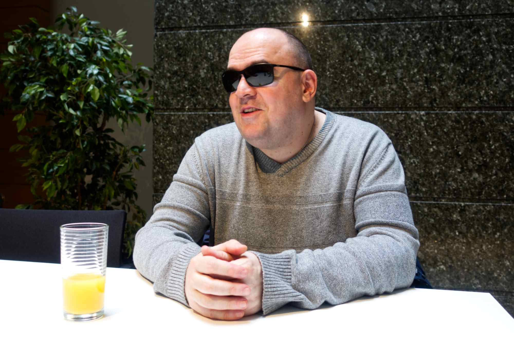

<hgroup> 
    <h1><q>Je sais ce que je ne pourrais pas réaliser sans l’accessibilité</q></h1>
    
Mario Perčinić vit et travaille au Luxembourg depuis 2016. Avec lui, nous avons parlé de musique, de programmation, de shopping et, bien sûr, d'accessibilité.

</hgroup>

 
    
M. Perčinić travaille au Centre pour le développement des compétences relatives à la vue (CDV) à Bertrange. Il est transcripteur et adapte des livres pour les élèves et étudiants aveugles ou malvoyants, sous différents formats (ePub, Braille ou imprimé, pour n’en citer que quelques-uns). Il est également un musicien aux multiples talents, joue dans un groupe de hard rock The Velvet au Luxembourg, enregistre des albums et donne des concerts dans tout le pays. Enfin, il s’intéresse à la technologie et à l’accessibilité de tous les gadgets possibles, qui peuvent offrir une meilleure qualité de vie aux personnes aveugles. En tant que personne aveugle, il se débrouille dans un monde qui ne place pas toujours l’accessibilité au centre de ses préoccupations.

<figure role="group" aria-label="Mario Perčinić. Photo : Dominique Nauroy" class="pic"> 
     
    <figcaption>Mario Perčinić. Photo : Dominique Nauroy</figcaption>
</figure>
<h2>Quelle importance accordez-vous à l’accessibilité numérique&nbsp;?</h2>

Nous avons fait du chemin. Tout ce qui touche aux technologies d’assistance était au départ destiné aux geeks… loin d’être grand public. Aujourd’hui, je peux entrer dans un magasin, acheter n’importe quel type de PC ou un smartphone, installer moi-même Windows et me procurer un lecteur d’écran gratuit, qui fera parfaitement l’affaire. Il y a dix ou quinze ans, ce scénario était impossible.

<h2>Vous prenez l’exemple des achats dans un lieu physique&nbsp;: est-il plus facile pour vous de faire des achats en ligne aujourd’hui&nbsp;?</h2>

Bien sûr. Je ne peux pas entrer seul dans le magasin car je ne sais pas à quoi il ressemble. Je ne peux compter que sur l'aide physique de la personne qui m'accompagne ou du vendeur qui travaille dans le magasin.

<blockquote>
« Pendant la pandémie (...) j'étais très dépendant des achats en ligne… c'était bien pour survivre&nbsp;! »
</blockquote>

Si je navigue sur une boutique en ligne, en tenant compte du fait que le site Web est accessible, je peux remarquer ce qui est disponible dans certaines catégories et acheter ce que je veux de manière indépendante.

Pendant la pandémie, je ne pouvais pas me rendre à pied dans les supermarchés et personne ne pouvait m'aider. J'étais très dépendant des achats en ligne… c'était bien pour survivre&nbsp;! Maintenant que tout est redevenu normal, j'espérais qu'il y aurait beaucoup plus de magasins en ligne au Luxembourg, malheureusement cela n'a pas été le cas.

Par ailleurs, il y a encore des progrès à faire en matière de commerce électronique. De nombreux sites Web ne sont pas accessibles, ou semblent l'être jusqu'à ce que vous commenciez à creuser plus profondément, par exemple si vous souhaitez accéder à des informations détaillées sur un produit donné.

<h2>Remarquez-vous une différence dans l’accès aux sites Web et aux applications, selon qu’ils sont publics ou privés&nbsp;?</h2>

Bien sûr. Surtout depuis que la directive est entrée en vigueur en 2019. Je dois également souligner le très bon travail effectué ici au SIP (Service d'information et de presse). La plupart de mes plaintes ont été résolues.

<h2>Si vous pouviez changer une chose majeure dans le domaine de l’accessibilité, que changeriez-vous&nbsp;?</h2>
<blockquote>
« En 2023, nous devons avoir des documents et des formulaires publics accessibles, quel que soit notre type de handicap. »
</blockquote>

Les formulaires PDF. J'ai récemment demandé la nationalité luxembourgeoise. Il faut remplir des formulaires PDF disponibles sur guichet.lu. Ils étaient totalement inaccessibles. En 2023, nous devons avoir des documents et formulaires publics accessibles, quel que soit notre type de handicap.

Grâce au SIP, ces formulaires ont été corrigés sur guichet.lu et j'ai pu les remplir moi-même. J'ai demandé à un ami voyant de les vérifier et c'était correct. Je les ai déposés, je suis allé moi-même à la commune et j'ai effectué toutes les démarches moi-même. Au final, tout cela vous apporte un grand sourire sur le visage.

Les personnes aveugles ne peuvent pas réparer elles-mêmes les formulaires PDF, car ni Acrobat Pro - l'outil principal pour résoudre ce problème - ni les autres logiciels ne sont accessibles à 100 %.

<h2>De l’autre côté, quels progrès avez-vous constatés&nbsp;?</h2>

En tant que représentant du Comité d'accès et de technologie, qui a travaillé pour le compte de l'Union européenne des aveugles, j'ai eu l'occasion de participer à deux sommets sur l'accessibilité chez Google en 2013 et 2015. Il est intéressant de voir du point de vue d'un initié comment une entreprise aussi grande se consacre à l'accessibilité. Lorsque des géants comme Google, Apple et Microsoft s'engagent réellement en faveur de l'accessibilité en suivant les règles de l'accès universel, cela peut changer considérablement la qualité de vie des populations handicapées, et c'est sans aucun doute un énorme changement de jeu.

Le lecteur d'écran de Microsoft, Narrator, a beaucoup évolué. Il manque une chose&nbsp;: le scripting. Pour les utilisateurs expérimentés, JAWS et NVDA sont scriptables. Le langage de script JAWS est assez facile à apprendre si vous connaissez les bases de la programmation. Avec NVDA, vous devez connaître Python, également facile à apprendre si vous aimez la programmation. Au quotidien, j'utilise de nombreux modules complémentaires pour NVDA. Ils étendent ses fonctionnalités, de différentes applications Windows à l'extension de l'utilisation et de l'accessibilité des navigateurs, des applications Web ou des clients de messagerie.

<h2>Les développeurs d’aujourd’hui ont-ils une bonne culture de l’accessibilité&nbsp;?</h2>
<blockquote>
« Nous avons besoin de personnes à certains postes dans les organisations pour personnes handicapées qui comprennent ce qu'est l'accessibilité numérique.
</blockquote>

Je connais de bons développeurs, mais la plupart du temps ils n'ont aucune idée de l'accessibilité, même si cela évolue lentement. Il faut comprendre le sujet. Sinon, on résout les problèmes simplement parce que quelqu'un d'autre nous l'a dit. L'accessibilité sera alors toujours un problème. Les personnes handicapées sont de bons candidats pour ce genre d'emplois.

Nous avons besoin de personnes à certains postes au sein des organisations de personnes handicapées qui comprennent ce qu'est l'accessibilité numérique. Si nous avons des personnes incompétentes ou pas suffisamment formées en matière d'accessibilité et d'utilisabilité numériques, les choses peuvent très mal tourner.

Je me battrai toujours pour l'accessibilité. Je sais ce que je ne pourrais pas accomplir sans elle. L'accessibilité aide tout le monde. Nous devons comprendre cela. Une fonction de base comme Control-S dans Word est une fonction d'accessibilité. Elle est utile à tous.

<h2>Avez-vous quelques exemples de barrières numériques que vous rencontrez au quotidien&nbsp;?</h2>

Il y a environ deux ans, j'ai eu des problèmes d'accessibilité avec Luxtrust sur Android. Cette méthode d'authentification est cruciale dans la vie quotidienne moderne au Luxembourg pour tout le monde. Si vous ne pouvez pas l'utiliser, c'est un désastre. Je n'étais probablement pas le seul à m'en plaindre, heureusement avec l'aide de SIP nous avons pu résoudre le problème en quelques semaines.

Lorsqu'une application reçoit une mise à jour majeure, cela ne signifie pas automatiquement qu'elle est plus accessible. Un autre exemple serait l'application Restopolis, utile pour savoir ce qu'il y a au menu du midi. Je l'utilise tous les jours. Lorsque la version 2 est sortie, elle est devenue complètement inutilisable. Heureusement, des bugs majeurs pour les utilisateurs d'Android ont maintenant été corrigés.

J'utilise aussi régulièrement l'application Adapto, au début c'était un échec total. Une fois de plus, dans la dernière mise à jour de l'application, les choses les plus critiques ont été corrigées. Elle n'est pas parfaite, il y a beaucoup d'erreurs gênantes, mais je peux l'utiliser. Également dans le domaine de la mobilité : aucun site Web des compagnies aériennes en Europe n'est accessible à l'heure actuelle. Je dois toujours demander à quelqu'un d'autre de m'aider à acheter un billet.

J'ai vu de nombreuses applications et sites Web évoluer grâce au <a href="https://accessibilite.public.lu/en/news/2023-02-24-complaints2022.html">mécanisme de réclamation</a> . Mais beaucoup de gens ne le savent pas.

<h2>Outre l’accessibilité numérique en général, qu’aimeriez-vous améliorer&nbsp;?</h2>

Si j'avais quelques millions, je travaillerais certainement à fournir des solutions accessibles aux musiciens aveugles. Par exemple, un accordeur de guitare classique que l'on trouve à chaque coin de rue est inaccessible pour moi. De plus en plus de guitaristes passent d'une amplification classique sur scène à diverses unités d'effets numériques, également appelées amplis à modélisation&nbsp;: ils utilisent essentiellement des écrans tactiles et sont donc complètement inaccessibles à la communauté aveugle. Les fabricants qui fabriquent des produits inaccessibles laissent le groupe d'utilisateurs complètement à l'écart, ce qui est absolument injuste.

Dans The Velvet, je suis le claviériste et le chanteur principal. Beaucoup de synthétiseurs et de claviers modernes ne sont pas accessibles aux musiciens aveugles. Heureusement pour moi, j'ai pu trouver un clone de l'orgue Hammond, il n'a pas d'écran et donc tous les paramètres peuvent être modifiés directement via les boutons ou les interrupteurs.

    

        <iframe src="https://www.youtube.com/embed/xULJa1Wm8h8" title="The Velvet - Electric wizard, video on YouTube" allow="accelerometer; autoplay; clipboard-write; encrypted-media; gyroscope; picture-in-picture; web-share" allowfullscreen></iframe>
    

    
The Velvet's 'Electric Wizard' music video

    

        
<h3>Lyrics</h3>

        
To the thunder and lightnings of a whirling storm

        
A visionary genius a prodigy was born

        
Destined to unravel the secret of the gods

        
Destined to ignite the wrath of the lords

        
Wizard without hat and tricks

        
Witchcraft without cans and bricks

        
Wizard without hat and tricks

        
Witchcraft without cans and bricks

        
The electric wizard

        
Neon messiah, master of the lightning

        
exploited by the thiefs

        
His gift of enlightment

        
destroyed by the kings

        
Wizard without hat and tricks

        
Witchcraft without cans and bricks

        
Wizard without hat and tricks

        
Witchcraft without cans and bricks

        
The electric wizard

    

Mon deuxième clavier, appelé Crumar Seven, est plus complexe et dispose d'un excellent système d'édition en profondeur. Je peux me connecter à son application Web via son récepteur Wi-Fi et effectuer toutes les modifications. L'interface semble très accessible à tous les lecteurs d'écran.

Les personnes aveugles peuvent être de très bons ingénieurs du son et producteurs de musique. Cependant, les outils nécessaires à ces tâches doivent être accessibles. En tant qu'utilisateur Windows, j'ai découvert que je pouvais faire tout cela en utilisant Reaper comme éditeur audio multipiste principal. Il est bon marché, très flexible et les développeurs de Reaper sont très réactifs lorsqu'il s'agit de corriger les problèmes d'accessibilité. En même temps, la communauté des aveugles, des développeurs aux utilisateurs expérimentés, fournit une excellente bibliothèque supplémentaire de scripts et de modules complémentaires améliorant la convivialité de Reaper (consultez ici le <a href="https://reaperaccessibility.com/index.php/Main_Page">wiki d'accessibilité de Reaper</a> ). Logic Pro est un autre bon exemple, cette application disponible sur macOS est totalement accessible via VoiceOver.

Encore une fois, je regrette que les organisations représentant les aveugles ne fassent pas davantage de lobbying en disant&nbsp;: si vous répariez ces produits, vous auriez plus de clients.

<aside class="contextbox"> 
    <h2>Le mécanisme de plainte</h2> 
    
Si vous constatez un manque d’accessibilité sur un site internet ou une application mobile d’un organisme public luxembourgeois, vous pouvez dans un premier temps contacter directement l’organisme.
 
    
Si vous n'obtenez pas satisfaction, veuillez contacter le SIP ou l'Ombudsman.
 
    
Ce <a href="https://sip.gouvernement.lu/en/support/reclamation-accessibilite.html">formulaire de plainte en matière d’accessibilité</a> est disponible sur le site Web du SIP.
 
    
Lorsqu'une plainte est déposée via ce formulaire, le SIP agit en tant que médiateur entre le citoyen et l'organisme du secteur public. Le SIP informe ensuite l'utilisateur des conclusions, dès qu'une solution a été proposée. Dans le cas où les problèmes d'accessibilité signalés ne relèvent pas du champ d'application de la loi du 28 mai 2019, le SIP informe l'organisme responsable et donne un retour d'information au plaignant, même s'il n'existe aucune obligation légale à respecter.
 
    
L' <a href="https://www.ombudsman.lu/">Ombudsman</a> peut également agir en tant que médiateur conformément à la loi et suivre une procédure similaire.

</aside>
