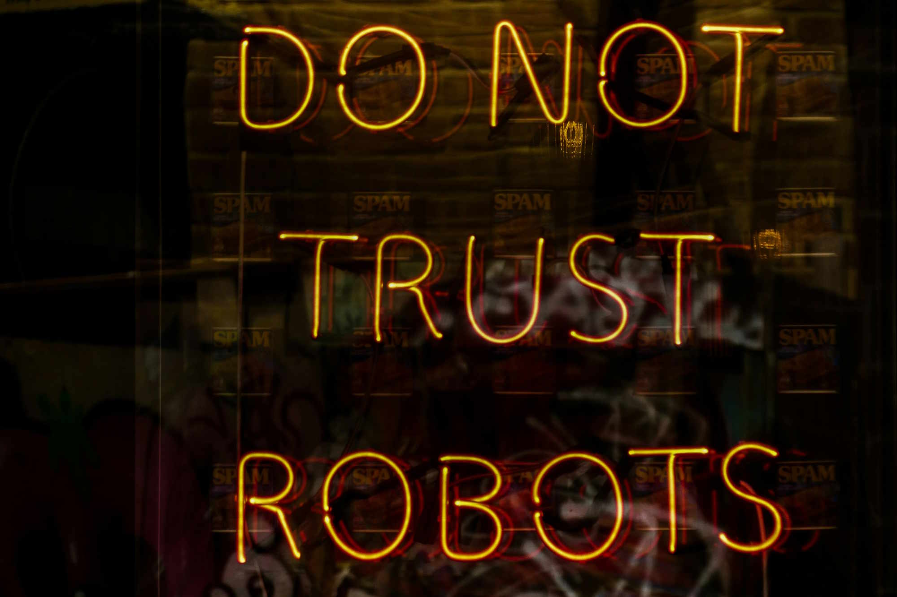
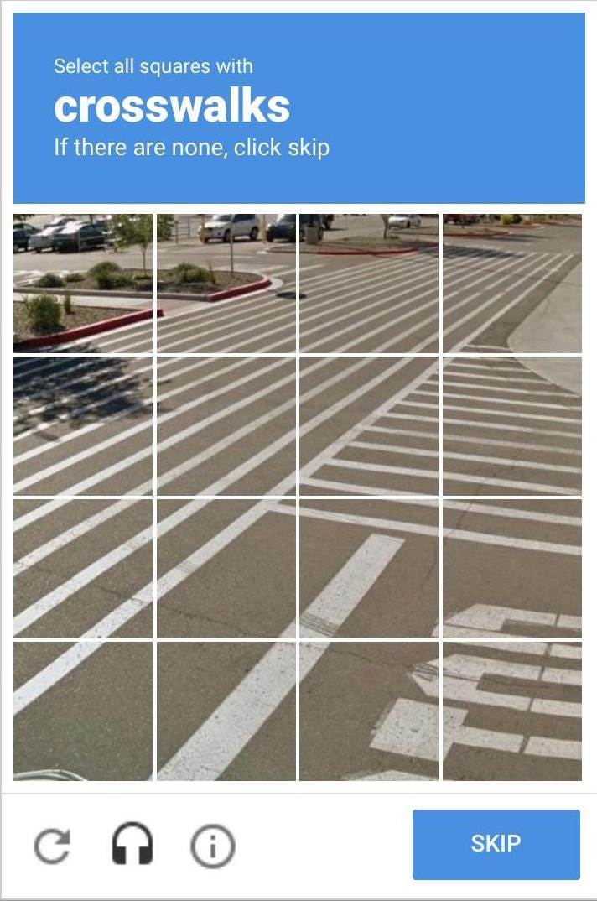
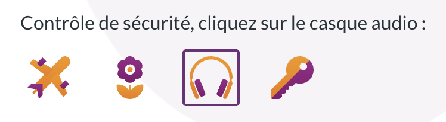
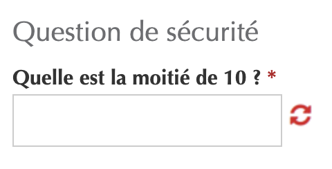

<hgroup>
	<h1>CAPTCHA, quand la sécurité prend le pas sur l’accessibilité</h1>
	
Selon le dernier sondage WEBaim sur les utilisateurs de lecteurs d’écrans, les CAPTCHAs constituent encore le premier problème d’accessibilité pour ce public. On fait le point sur cette technologie et son impact sur l’accessibilité en général et au Luxembourg en particulier.

</hgroup>

<figure role="group" aria-label="Photo de Nick Fewings sur Unsplash" class="pic">
    
    <figcaption>Photo de <a href="https://unsplash.com/fr/@jannerboy62">Nick Fewings</a> sur <a href="https://unsplash.com/fr/photos/texte-C2J92BO3qTw">Unsplash</a>
      </figcaption>
</figure>
<h2>Qu’est-ce qu’un CAPTCHA ?</h2>

Un <a href="https://fr.wikipedia.org/wiki/CAPTCHA">CAPTCHA</a> (<i lang="en">Completely Automated Public Turing test to tell Computers and Humans Apart</i>) est un test dont le but est de différencier les utilisateurs humains des robots.

Les CAPTCHAs sont utilisés le plus souvent pour éviter :

<ul>
<li>le spam sur des formulaires permettant de saisir des informations sans être authentifié ;</li>
<li>le scraping de sites web, i.e. l’extraction automatique de données à partir de pages web ;</li>
<li>certaines attaques par force brute (ex: chercher le mot de passe d’un compte en essayant rapidement un grand nombre de mots de passes possibles).</li>
</ul>

Le CAPTCHA classique est un test visuel qui affiche un texte déformé dans une image, et il est nécessaire de recopier le contenu de cette image dans un champ de formulaire. 
Ce test basé sur la vision est bien entendu inaccessible pour les personnes avec un handicap visuel, s’il n’est pas assorti d’une alternative, par exemple audio (ex: <a href="https://accessibilite.public.lu/fr/raweb1/criteres.html#crit-1-5">critère RAWeb 1.5</a>).

<figure role="group" aria-label="Exemple de CAPTCHA visuel (source Wikipedia)" class="smallpic">
    
    <figcaption>Exemple de CAPTCHA visuel (source Wikipedia)</figcaption>
</figure>

Ce test étant particulièrement vulnérable aux progrès réalisés par les IA, il est de moins en moins souvent utilisé et d’autres types de CAPTCHAs ont été développés, comme les tests demandant de reconnaître des objets :

<figure role="group" aria-label="Capture d’écran de ReCAPTCHA v2" class="smallpic">
    
    <figcaption>Capture d’écran de ReCAPTCHA v2</figcaption>
</figure>
<h2>Accessibilité des CAPTCHAs, quels problèmes ?</h2>

D’après <a href="https://webaim.org/projects/screenreadersurvey10/#problematic">la dernière étude WebAIM réalisée auprès d’utilisateurs de lecteurs d’écrans</a> en 2024, les CAPTCHAs sont toujours pour les aveugles et les grands malvoyants le problème d’accessibilité numéro 1 sur le web. 

En fonction des types de CAPTCHAs, ils peuvent aussi être un problème pour les personnes sourdes ou malentendantes (CAPTCHA audio), avec un handicap moteur (CAPTCHA où il faut aligner des images qui nécessitent une motricité fine), ou avec un handicap cognitif (calculs, puzzles, …). Même en termes d’expérience utilisateur en général, c’est problématique car on cherche à résoudre un problème technique en s’appuyant sur l’utilisateur, sans contrepartie pour celui-ci.

De plus en plus de CAPTCHAs essayent de détecter les robots de manière transparente, c’est-à-dire en analysant les caractéristiques du navigateur et les motifs d’interaction (ex: mouvements de la souris) pour voir si ceux-ci correspondent à ce qui est attendu d’un utilisateur normal. Cette approche peut bien entendu causer des problèmes surtout si la définition de cet utilisateur “normal” n’inclut pas les personnes en situation de handicap. Un utilisateur de technologie d’assistance ne navigue pas du tout de la même manière qu’un utilisateur sans technologie d’assistance. Par exemple, les utilisateurs de lecteurs d’écrans n’utilisent en général pas la souris mais le clavier pour naviguer sur le web. Le CAPTCHA devra donc gérer ces cas et éviter de discriminer les utilisateurs sur base de leur handicap.

En outre, les CAPTCHAs se situent le plus souvent sur le chemin critique d’une démarche en ligne, par exemple sur un formulaire d’inscription. Un CAPTCHA inaccessible bloque dans ce cas l’accès au service à toute une catégorie de la population sur base de leur handicap.

Comme on le rappelle souvent, au Luxembourg, cela représente 15 % de la population d’après <a href="https://statistiques.public.lu/fr/actualites/2024/stn09-handicap.html">la dernière étude du STATEC sur le sujet</a>.

<h2>Les CAPTCHAs sur les sites publics luxembourgeois</h2>

Afin de mieux comprendre la situation sur les sites publics luxembourgeois, nous avons réalisé une étude en septembre 2025, en utilisant notre outil capable de détecter 13 solutions de CAPTCHAs du marché. Sur 821 sites testés, nous avons détecté 101 sites qui présentaient un CAPTCHA sur au moins une page, soit environ un site sur huit.
Plus précisément, les solutions suivantes ont été détectées :

<ul>
<li>reCAPTCHA sur 98 sites</li>
<li>Friendly Captcha sur 2 sites</li>
<li>hCaptcha sur 1 site</li>
</ul>

Bien entendu, il est possible que d’autres types de CAPTCHAs soient présents et n’aient pas été détectés. Nous avons notamment détecté manuellement sur d’autres sites publics des CAPTCHAs non accessibles, mais cette recherche manuelle rend l’étude difficilement viable sur l’ensemble des pages des sites publics connus de nos services.

<figure role="group" aria-label="Exemple de CAPTCHA visuel non accessible détecté sur un site public" class="smallpic">
    
    <figcaption>Exemple de CAPTCHA visuel non accessible détecté sur un site public</figcaption>
</figure>

Vous pouvez retrouver <a href="https://data.public.lu/fr/datasets/detection-de-captchas-sur-les-sites-web-du-secteur-public/">les résultats de cette étude sur data.public.lu</a>.

Ces CAPTCHAs sont présents essentiellement sur des sites de communes et de syndicats de communes (37), d’établissements publics et apparentés (58). Les sites de l'État central (6) sont globalement épargnés, ce qui montre que d’autres solutions existent.

L’immense majorité des sites sur lesquels nous avons détecté un CAPTCHA utilisent la solution reCAPTCHA de Google. Cette solution est efficace mais est controversée pour son utilisation des données personnelles de chaque visiteur et nécessite en Europe une demande de consentement pour être conforme au RGPD.

Il existe trois versions différentes de reCAPTCHA :

<ul>
<li>la v3 qui est transparente, c’est-à-dire qu’elle ne demande aucune interaction de la part des utilisateurs ;</li>
<li>la v2 avec case à cocher, qui est très connue, car c’est celle qui demande de reconnaître des objets (passages piétons, bornes à incendie, etc.) ;</li>
<li>la v2 invisible, qui est similaire à la v3.</li>
</ul>

Nous ne pouvons pas recommander l’utilisation de la v2, car d’après la note “<a lang="en" href="https://w3c.github.io/captcha-accessibility/#the-google-recaptcha-v2">Inaccessibility of CAPTCHA</a>” du W3C, elle a récemment subi des régressions en termes d’accessibilité, qu’il s’agisse de navigation au clavier ou d’alternatives audio.

La v3 étant transparente, elle ne pose pas de problème d’accessibilité en soi. Des problèmes peuvent survenir lorsque reCAPTCHA v3 n’est pas certain que l’utilisateur soit humain, laissant à la charge du responsable du site de gérer cette situation, ce qui peut amener le site à afficher un CAPTCHA traditionnel inaccessible ou à bloquer l’utilisateur.

Si l’approche des CAPTCHAs transparents est intéressante, chaque responsable de site doit effectuer des tests d’accessibilité pour s’assurer que les utilisateurs en situation de handicap ne risquent pas d’être systématiquement bloqués par ces dispositifs.

Parmi les 98 sites qui utilisent la solution reCAPTCHA, nous avons détecté 53 sites présentant un mode interactif avec reconnaissance d’objets fourni par une v2 de reCAPTCHA. Il y a donc actuellement plus de la moitié des CAPTCHAs présents sur des sites publics qui posent des problèmes d’accessibilité.

<h2>Des alternatives aux CAPTCHAs</h2>

De nombreux services appelés <i lang="en">CAPTCHA solvers</i> existent maintenant pour résoudre les CAPTCHAs contre rémunération. Certaines personnes aveugles utilisent aussi les services de certains LLM avec un prompt adéquat pour résoudre les CAPTCHAs avec un taux de succès élevé.

L’efficacité limitée des CAPTCHAs n’étant plus à démontrer, il se peut, en fonction des cas d’usages, que d’autres dispositifs de sécurité soient plus à même de protéger votre site web, tout en limitant l’impact sur les utilisateurs. Il peut par exemple s’agir d’un filtre antispam pour un formulaire de contact, ou bien d’un “<i lang="en">Web Application Firewall</i>” pour protéger globalement votre site web de requêtes malveillantes.

Le W3C, dans sa note “<a lang="en" href="https://w3c.github.io/captcha-accessibility/#the-google-recaptcha-v2">Inaccessibility of CAPTCHA</a>”, évoque toute une série d’approches de l’état de l’art qui peuvent répondre à ces besoins de sécurité sans avoir le même impact négatif sur l’accessibilité. Deux types d’approches sont considérés : 

<ul>
<li>Les approches interactives, dans lesquelles l’utilisateur doit réaliser une action pour prouver qu’il est un humain. Parmi ces approches, il y a l’authentification multi-devices, un peu similaire à ce qui est fait dans le cadre de la double authentification sur un site, ou bien encore <a href="https://developers.cloudflare.com/fundamentals/reference/cryptographic-personhood/">l’attestation cryptographique de personnalité</a>, concept développé par exemple par Cloudflare comme alternative aux CAPTCHAs ;</li>
<li>Les approches non interactives, dans lesquelles on retrouve la plupart des CAPTCHAs transparents mentionnés ci-dessus. La note du W3C détaille différentes approches (ex: <i lang="en">honeypot, proof-of-work</i>) qui peuvent être combinées les unes avec les autres sans aucun impact utilisateur.</li>
</ul>

Une nouvelle famille de CAPTCHAs se base sur l’approche <i lang="en">proof-of-work</i> (ex: <a lang="en" href="https://friendlycaptcha.com/">Friendly Captcha</a>, <a lang="en" href="https://capjs.js.org/">Cap</a>, <a lang="en" href="https://mcaptcha.org/">mCaptcha</a>, …) et donne en général de bons résultats tant au niveau de l’accessibilité que du respect de la vie privée. Cette approche ne nécessite a priori pas d’interaction, même si certains CAPTCHAs requièrent tout de même de cocher une case “je ne suis pas un robot”. Le principe sous-jacent est de faire réaliser à votre ordinateur des calculs cryptographiques difficiles. Pour un utilisateur, ces calculs vont demander quelques secondes. Pour un robot, si ces calculs doivent être réalisés régulièrement, leur coût va être prohibitif.

<h2>Des nouvelles exigences, soyez préparés !</h2>

Les CAPTCHAs sont souvent mis en place sur des formulaires de contact. Depuis l’entrée en vigueur le 28 juin 2025 de la <a href="https://legilux.public.lu/eli/etat/leg/loi/2023/03/08/a133/consolide/20250628">loi du 8 mars 2023</a> sur l’accessibilité des produits et services, ces formulaires de contact peuvent être considérés comme des services de communication électroniques. Dans ces conditions, un CAPTCHA inaccessible sur une page de contact pourrait rendre ce service non conforme et pourrait exposer tout organisme du secteur public ou privé à des sanctions.

N’hésitez pas à contacter l’organisme de surveillance compétent sur l’accessibilité des produits et services, <a href="https://accessibilite-produits-services.public.lu/fr.html">l’OSAPS</a>, si vous avez des questions à ce sujet.

Par ailleurs, les CAPTCHAs qui testent les fonctions cognitives ne seront plus autorisés sur les sites et apps du secteur public lors de la prochaine mise à jour de la norme européenne EN 301 549 qui paraîtra en 2026. En effet, celle-ci va inclure le nouveau critère de succès WCAG 2.2 "<a href="https://www.w3.org/Translations/WCAG22-fr/#accessible-authentication-minimum">Authentification accessible (minimum)</a>".

Le principe de ce critère est d’éviter les tests cognitifs (puzzles, calculs) qui ne sont pas assortis par exemple d’une alternative ou d’une aide.

<figure role="group" aria-label="Capture d’écran de MyGuichet (septembre 2025)" class="smallpic">
    
    <figcaption>Capture d’écran de MyGuichet (septembre 2025)</figcaption>
</figure>

Les CAPTCHAs visuels qui demandent une reconnaissance d’objets sont une exception à ce critère. Ceux-ci demanderont néanmoins une alternative non visuelle.

<h2>En conclusion</h2>

Au Luxembourg, environ un site public sur huit que nous avons testé présente un CAPTCHA. Plus de la moitié des CAPTCHAs présents sur les sites publics posent des problèmes d’accessibilité. Si certaines solutions proposées ont un impact utilisateur faible (CAPTCHA transparents, <i lang="en">proof-of-work</i>) il est néanmoins de la responsabilité de chaque responsable de site de s’assurer que les personnes en situation de handicap ne vont pas être bloquées par ces dispositifs.

Si vous pensez avoir besoin d’un CAPTCHA, considérez la possibilité d’utiliser d’autres systèmes de sécurité. Si vous êtes certains que le CAPTCHA est la solution à vos besoins, dans ce cas, considérez en priorité des solutions transparentes et effectuez des tests avec des technologies d’assistance et éventuellement des utilisateurs concernés pour vous assurer que ces solutions sont bien compatibles.

<aside class="more">
    <h2>En savoir plus</h2>
    <ul>
        <li><a lang="en" href="https://w3c.github.io/captcha-accessibility/">Inaccessibility of CAPTCHA, W3C</a></li>
        <li><a href="https://www.w3.org/Translations/WCAG22-fr/#accessible-authentication-minimum">"Authentification accessible (minimum)"</a>, WCAG 2.2</li>
        <li><a lang="en" href="https://blog.pope.tech/2022/11/08/captcha-challenges-arent-accessible-but-your-website-can-be-accessible-and-secure/">CAPTCHA challenges aren’t accessible, but your website can be accessible and secure, PopeTech</a></li>
        <li><a lang="en" href="https://a11yboost.com/articles/are-captcha-systems-failing-accessibility">Are CAPTCHA Systems Failing Accessibility?</a></li>
        <li><a href="https://github.com/accessibility-luxembourg/captchaCrawler">Outil captchaCrawler du SIP sur GitHub</a></li>
    </ul>
</aside>