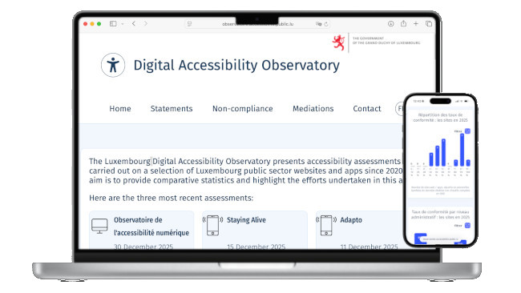

<hgroup>
	<h1>L'accessibilité numérique se dote d'un observatoire</h1>
	
Nous vous présentons le dernier-né des sites conçus et gérés par le Service information et presse&#8239;: l'Observatoire de l'accessibilité numérique, qui ambitionne de vous présenter toutes les données relatives à l'accessibilité, actualisées fréquemment.

</hgroup>

<figure role="group" aria-label="Photo de Lacheev sur iStock" class="pic">
    
    <figcaption>Photo de <a href="https://www.istockphoto.com/portfolio/Lacheev?mediatype=photography">Lacheev</a> sur <a href="https://www.istockphoto.com/photo/young-man-office-employee-looking-at-laptop-screen-through-binocular-studio-shot-gm2248436528-662284529">iStock</a>
      </figcaption>
</figure>

Une synthèse annuelle sur l’état de l’accessibilité numérique des services publics luxembourgeois, c’est ce que vous propose jusqu’ici le Portail de l’accessibilité numérique. Il était possible d’aller plus loin, de mieux mettre en valeur les données recueillies depuis 2021&#8239;: c’est chose faite. Depuis hier, l’[Observatoire de l’accessibilité numérique est en ligne](https://observatoire.accessibilite.public.lu/fr/home).

Voici ce qu’il va vous apporter&#8239;:

- Des données précises et comparatives sur 
   - les audits menés par le Service information et presse (SIP)&#8239;;
   - les déclarations d’accessibilité&#8239;;
   - les médiations menées par le SIP&#8239;;
   - et les non-conformités les plus fréquemment recensées.
- Ces données seront fréquemment actualisées, et celles déjà disponibles proposent un historique sur les cinq dernières années&#8239;: il est donc aisé de constater l’évolution de la conformité, par plateforme ou encore par niveau administratif.

Tout comme le Portail de l’accessibilité numérique, l’Observatoire est proposé en deux langues&#8239;: français et anglais.

## Les fonctionnalités en détails

<figure role="group" class="smallpic">
    
</figure>

### Le classement de l'accessibilité

Premier module à s'afficher en page d'accueil, [le classement de l'accessibilité](https://observatoire.accessibilite.public.lu/fr/home#TopWebsites-Title) veut témoigner de l'effort continu entrepris par l'administration publique en faveur de l'accessibilité numérique. Il est aisé de comparer les scores d'une année sur l'autre, d'une plate-forme à l'autre.

Mais c'est surtout une information destinée aux personnes en situation de handicap&#8239;: directement, elles trouvent ici les références des sites et apps mobiles dont elles savent qu'elles pourront accéder aux fonctionnalités et aux contenus sans trop de problèmes.

Le choix d'un site ou d'une app mène à une page où tous les détails de l'audit sont décortiqués. Mieux&#8239;: si ce site ou cette app a fait l'objet d'autres audits, notamment lors d'années antérieures, il est possible d'y accéder en un clic.

### La répartition des taux de conformité

Cette vue [« répartition des taux de conformité »](https://observatoire.accessibilite.public.lu/fr/home#Percentiles-Title), qui reprend les mêmes données mais les segmente en percentiles, est sans doute la plus adaptée pour suivre l'évolution de l'accessibilité depuis les premiers audits, en 2021. Là aussi, il est possible d'afficher les sites qui se trouvent répertoriés dans chaque colonne et d'accéder aux détails de l'évaluation.

### Les taux de conformité par niveau administratif

Y a-t-il une différence notable entre les niveaux étatique, communal et celui des organismes de droit public ? C'est à cette question que répond le module [« taux de conformité par niveau administratif »](https://observatoire.accessibilite.public.lu/fr/home#AdminLevels-Title), qui propose également une recherche historique.

### Les déclarations

Indispensables aux personnes en situation de handicap et obligatoires selon la loi du 28 mai 2019, les [déclarations d'accessibilité](/fr/obligations.html#d%C3%A9claration-d%E2%80%99accessibilit%C3%A9) sont pourtant peu présentes&#8239;: à peine un site sur deux dispose d'une déclaration complète et actualisée, et une app sur dix (voir la page [« déclarations »](https://observatoire.accessibilite.public.lu/fr/statements)). L'espoir est de voir peu à peu cette obligation légale mieux respectée.

### Les non-conformités

Qu'est-ce qui cloche dans la conception ou l'éditorialisation des pages d'un site, ou des écrans d'une application mobile ? Où se situent les principales barrières numériques ? Vidéos, structure des pages, formulaires, images, documents bureautiques...&#8239;: où faut-il mettre l'accent en matière de formation des agents ? D'une année à l'autre, retrouve-t-on les mêmes éléments bloquants ? C'est pour répondre à ces questions que cette page [« non-conformités »](https://observatoire.accessibilite.public.lu/fr/conformities) a été conçue. Ici, les critères des référentiels ont tous été synthétisés et vulgarisés, mais les experts disposent à chaque fois d'un lien pour se rendre sur le référentiel en question.

### Les médiations

Parmi les éléments clés d'une déclaration d'accessibilité, on trouve une adresse de contact pour poser des questions en rapport avec l'accessibilité numérique. Il peut arriver que le dialogue entre le citoyen et l'administration ne progresse pas de manière satisfaisante, c'est la raison pour laquelle le SIP, comme l'Ombudsman, a un rôle de médiateur. En conséquence, la page [« médiations »](https://observatoire.accessibilite.public.lu/fr/mediations) présente, pour chaque année, le nombre de requêtes soumises au SIP et, en parallèle, le nombre de réponses accessibles fournies par l'administration.

## L'accessibilité

Un des principaux défis à la création de ce site fut son accessibilité. En effet, ce site fait la part belle aux visualisations de données, celles-ci étant relativement complexes à rendre accessibles. Nous avons fait réaliser un [audit complet du site](https://observatoire.accessibilite.public.lu/fr/details_106) suivant le référentiel RAWeb et le site est totalement conforme.

## Et demain ?

Pour l'heure, ce sont les audits menés par le SIP qui constituent la matière première de l'Observatoire. Mais le SIP souhaite l'ouvrir à terme aux audits réalisés par d'autres administrations publiques au Luxembourg. Ce sera l'occasion d'une information complémentaire, enrichie et régulièrement mise à jour.

Cette plateforme est bien entendue amenée à évoluer. Si vous avez des retours ou des demandes à ce sujet, n'hésitez pas à [nous contacter](https://accessibilite.public.lu/fr/contact.html).

Ce projet, soutenu et financé par le [ministère de la Digitalisation](https://mindigital.gouvernement.lu/fr.html), a pu voir le jour grâce au programme [Tech-in-Gov](https://mindigital.gouvernement.lu/fr/dossiers/2024/tech-in-gov/projets-tech.html).