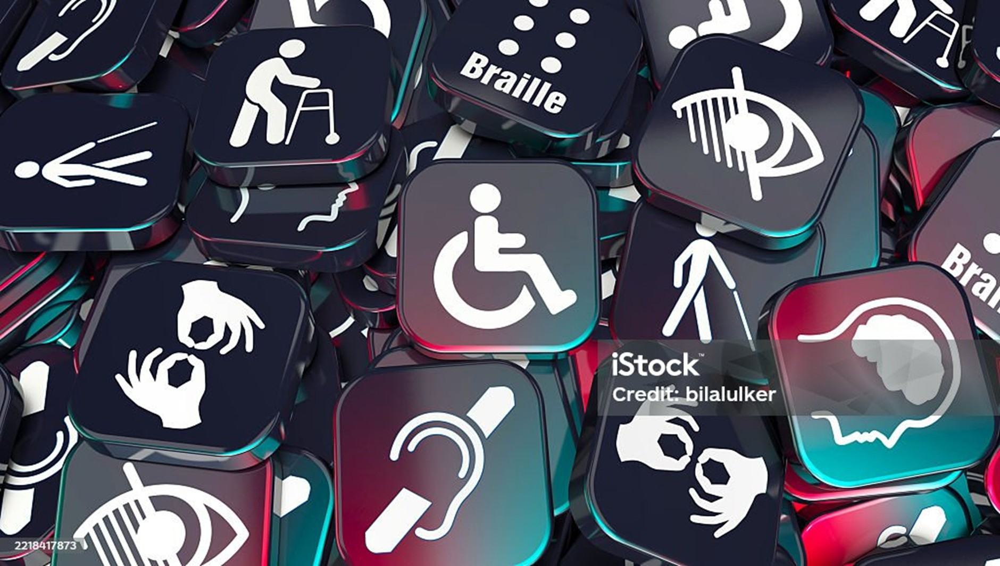

<hgroup>
	<h1>Les bons scores de l'État n'ont rien d'un coup de chance</h1>
	
L'analyse de la campagne d'audits d'accessibilité 2025 donne des nouvelles plutôt rassurantes quant au respect de l'accessibilité numérique sur les sites publics et, en particulier, étatiques.

</hgroup>

<figure role="group" aria-label="Image de bilalulker sur iStock" class="pic">
    
    <figcaption>Image de bilalulker sur iStock</figcaption>
</figure>

C'est un mouvement qu'on aimerait ne jamais voir faiblir : depuis 2021, les sites publics affichent une conformité croissante aux règles d'accessibilité numérique. Leur taux de conformité, qui atteignait 44% en 2021 et 61% en 2024, s'est porté l'an dernier à 66%.

Cette moyenne se concentre sur les seize sites qui ont bénéficié d'un audit complet. La progression constatée n'est pas le seul fruit de quelques locomotives qui tirent le taux moyen vers le haut : seuls quatre sites n'atteignent pas les 50%, soit la conformité partielle ; ils étaient six en 2024 sur un échantillon comparable.

<aside class="contextbox">
<h2>Le PDF, éternel maillon faible.</h2>

Un audit de site, ce sont des bons et des mauvais points (136 critères conformes ou non conformes) donnés sur une quinzaine de pages. Si un critère est non conforme sur une page, il le sera automatiquement pour toutes. L'an dernier, ce sont surtout les PDF non accessibles qui ont donné du fil à retordre aux auditeurs. Ils partagent la première place du podium des non-conformités les plus fréquentes avec deux autres barrières digitales très représentées : des hiérarchies de titres incohérentes et des scripts incompatibles avec les technologies d'assistance, empêchant ainsi leurs utilisateurs d'accéder à certains contenus.

Pour en savoir plus sur l'accessibilité des PDF, <a href="https://accessibilite.public.lu/fr/news/2023-04-28-des-pdf-majoritairement-inaccessibles.html">voici notre analyse sur les 17 sites publics les plus visités</a>.

</aside>

Certes, rares sont les sites qui parviennent à la conformité totale, objectif gravé dans la loi de mai 2019, mais la trajectoire est rassurante.

<figure class="chart">
    

        
    

    

        
<h4>Description du graphique 1</h4>

        

            

        

        
Ce diagramme en barre présente seize sites publics cibles d’audits complets en 2025 par ordre décroissant de conformité aux critères RAWeb, de l'Observatoire de l'accessibilité numérique (100%) au site snhbm.lu (39%).

    

    
Sous la barre des 50%, un site n’est pas considéré comme accessible. Soit 4 sur 16 sites audités

</figure>

De même, les apps se sont reprises, après deux années difficiles (43% puis 37% en 2023 - 2024). À 48% de taux de conformité, elles reviennent, à un point près, à leur niveau de 2022. Ce retour est donc à saluer, même si l'essai reste majoritairement à transformer.

Enfin, la moyenne des audits simplifiés augmente d'un point par rapport à 2024, à 62%. Chaque année, le Service information et presse (SIP) effectue, en complément des deux campagnes web et mobile, une centaine d'audits de sites, basés sur un petit nombre de pages à tester et de critères à évaluer.

<figure class="chart">
    

        
    

    

        
<h4>Description du graphique 2</h4>

        

            

        

        
Ce diagramme en colonnes présente les niveaux moyens de conformité selon l'appartenance du site au domaine de l'État (74%), au niveau local (communes, syndicats communaux, etc.&#8239;: 57%) ou à un autre niveau (établissements publics et organismes assimilés&#8239;: 59%), parmi 93 sites publics cibles d'audits simplifiés en 2025.

    

</figure>

Du fait de leur nombre, ces audits simplifiés permettent de tirer des conclusions par niveau administratif. Les sites étatiques s'en sortent particulièrement bien (74%, contre 57% pour les communes et 59% pour les organismes de droit public). Ces proportions sont restées sensiblement les mêmes d'une année à l'autre. Les chiffres sont plus flatteurs que ceux des audits complets, c'est compréhensible vu le périmètre d'évaluation plus restreint. Ils traduisent, cependant, un souci régulier porté à l'accessibilité numérique de la part des équipes de développement chargées des sites de l'État.

## Des déclarations trop souvent oubliées

Les déclarations d'accessibilité font en revanche pâle figure. Elles sont indispensables, pour préciser l'état de conformité d'un site ou d'une app, et délivrent des informations précieuses aux personnes en situation de handicap, qui peuvent connaître le détail des non-conformités et contacter, si besoin, l'organisme.

Or, parmi les sites recensés par le SIP, seule une moitié présente une déclaration d'accessibilité qui a été mise à jour il y a moins de trois ans. C'est bien trop peu, et la situation est encore plus alarmante pour les applications mobiles : seules 10% ont une déclaration actualisée.

Quand une demande, relative à l'accessibilité, est soumise à une administration, il peut arriver que le SIP joue le rôle de médiateur : cela s'est passé à six reprises l'an dernier. Dans deux cas sur trois, une solution accessible a été apportée endéans un mois, un score légèrement meilleur à celui de 2024.

## Un Observatoire de l'accessibilité numérique pour rester à la page

Lancé le 2 février, [l'Observatoire de l'accessibilité numérique](https://observatoire.accessibilite.public.lu/fr/home) a pour ambition de mieux mettre en valeur les efforts entrepris par les acteurs publics au service de cette cause. Il recense les données de plus de 550 audits, réalisés depuis 2021, et offre les outils pour comprendre les grandes tendances qui se jouent dans le domaine. Pour en savoir plus, nous vous invitons également à [lire notre article de présentation](https://accessibilite.public.lu/fr/news/index.html).