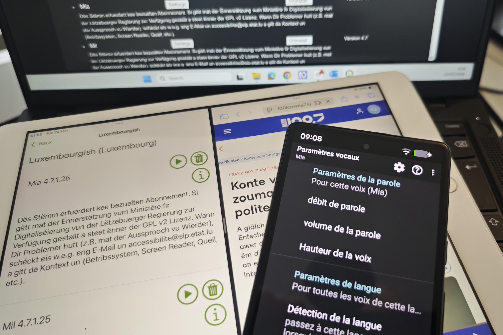

<hgroup>
	<h1>Deux voix nouvelles pour lire la langue de Dicks</h1>
	
En trois mois, Mia et Mil ont beaucoup appris. Ils ont aujourd'hui un bon niveau en luxembourgeois et sont amis avec les lecteurs d'écran les plus courants. On vous explique comment les adopter.

</hgroup>

<figure role="group" aria-label="Photo&#8239;: Dominique Nauroy" class="pic">
    
    <figcaption>Photo&#8239;: Dominique Nauroy</figcaption>
</figure>

Une voix féminine, une autre masculine, aussi à l'aises l'une que l'autre pour restituer des textes écrits en luxembourgeois, disponibles sur ordinateurs et smartphones&#8239;: c'est une première que le SIP vous propose d'essayer dès aujourd'hui.

Fruits de près d'un an de travail, Mia et Mil ont été à bonne école&#8239;: d'abord un passage par le *Zenter fir d'Lëtzebuerger Sprooch*{lang=lb} où ils ont appris au pas de course 70 000 mots luxembourgeois&#8239;; ensuite un coaching sévère chez LouderPages, éditeur qui s'y connaît en restitution vocale - à son actif, plusieurs synthèses vocales dédiées à des langues aussi diverses que le népali, le turkmène ou encore le tswana&#8239;; enfin une validation des acquis auprès des testeurs du Centre pour le développement des compétences relatives à la vue (CDV). Pendant tout ce temps, nous, au Service information et presse (SIP), jouions le rôle de parents.

    

        <iframe src="https://www.youtube.com/embed/5vQXrnT76zc" title="Mia&Mil Intro, vidéo YouTube" allow="accelerometer; autoplay; clipboard-write; encrypted-media; gyroscope; picture-in-picture; web-share" allowfullscreen></iframe>
    

    
Mil et Mia se présentent

    

        
<h3>Transcription</h3>

        
Moien, mäin Numm ass Mil.

        
Ech schwätzen Lëtzebuergesch.

        
Je parle aussi français.

        
Ich kann auch ein bisschen Deutsch.

        
I am the English voice, I am here to assist Mil for the English language.

        
Hallo, ech sinn d'Mia, ech sinn déi zweet Lëtzebuerger Stëmm vum "Screen Reader LB" Projet.

En janvier, Mia et Mil découvrent le grand monde&#8239;: tout un chacun peut installer les voix et proposer des améliorations. Ces retours de premiers utilisateurs ont été suivis jusqu'à la fin de la phase de bêta test, qui s'est terminée aujourd'hui.

## S'éloigner le plus possible de l'imperfection

Nous avons eu à cœur de vous offrir deux voix qui soient les moins imparfaites possibles. Or les défis étaient nombreux. Outre les spécificités de la langue luxembourgeoise, citons la capacité de pouvoir également prononcer correctement, dans un même texte, des extraits en français, anglais ou allemand. À cette fin, des dictionnaires additionnels ont été développés.

Chaque détail a son importance&#8239;: comment bien prononcer une date&#8239;? Un emoji&#8239;? Un acronyme&#8239;? Nous sommes ainsi habitués à entendre « C-G-DIS ». Il faut donc guider ces voix à travers des dictionnaires spécifiques, qui vont lui apprendre à prononcer « SIGI », « TICE » ou encore « ANLux » ainsi que nous le faisons au Luxembourg. Il en va de même des prénoms - Paulette, Emil, João... - et de certains noms de familles, de Bertemes à Zendaya en passant par Grethen et Weydert.

    

        <iframe src="https://www.youtube.com/embed/cL2MrN32bS0" title="Lecture d'un article sur la réforme du solfège, vidéo YouTube" allow="accelerometer; autoplay; clipboard-write; encrypted-media; gyroscope; picture-in-picture; web-share" allowfullscreen></iframe>
    

    
Lecture d'un article sur la réforme du solfège

    

        
<h3>Transcript</h3>

        
De Museksunterecht zu Lëtzebuerg gëtt moderniséiert: Reform vum Solfège ab 2026

        
Heading level one

        
Communiqué

        
Created on

        
19/01/2026

        
19 January 2026

        
Aktualiséiert den 20/01/2026

        
20/01/2026

        
De Museksunterrecht ass e wichtege Pilier vum lëtzebuergeschen Educatiounssystem. Fir d'Inhalter an d'pedagogesch Approchen ze moderniséieren an un déi aktuell Entwécklungen unzepassen, gëtt eng Reform vum Museksunterrecht op de Wee bruecht, mat engem besonnesche Fokus op d'Branche vun der Formation musicale (FM), allgemeng Solfège genannt. Déi grouss Linne vun dëser Reform goufen den 19. Januar 2026 bei enger Pressekonferenz vum Minister fir Educatioun, Kanner a Jugend, Claude Meisch, an der Micky Thein, Koordinatorin vum Aarbechtsgrupp, dee fir d'Reform vum Solfège zoustänneg ass, presentéiert.

    

Aujourd'hui, ces deux voix sont réactives, peuvent restituer un texte à haute vitesse et elles fonctionnent sans jamais avoir besoin de communiquer avec un serveur distant&#8239;: de la sorte, l'immédiateté mais aussi la confidentialité sont assurées.

Outre la fonction de lecteur d'écran, ces voix peuvent également être utilisées pour lire un texte à voix haute (fonction « Read aloud ») sous MacOS, avec la fonction d'accessibilité « [Énoncer la sélection](https://support.apple.com/fr-fr/guide/mac-help/mh27448/mac) » proposée par le système, et sous Windows avec des outils tiers comme [Balabolka](https://www.cross-plus-a.com/balabolka.htm) ou l'extension de navigateur « [Read aloud](https://addons.mozilla.org/en-US/firefox/addon/read-aloud/) ».

## Faites-leur passer une audition

Mia et Mil existent sur Windows, macOS, Android et iOS. Des guides ont été rédigés pour chaque plateforme, en quatre langues. Nous vous conseillons d’en prendre connaissance avant d’installer RHVoice et les voix luxembourgeoises sur votre téléphone, votre tablette ou votre ordinateur.

### Pour Windows
Les voix peuvent s’interfacer avec les lecteurs d’écran NVDA et JAWS.

- [Guide Windows en luxembourgeois](https://rhvoice.com/microsoft?lang=lb)
- [Guide Windows en français](https://rhvoice.com/microsoft?lang=fr)
- [Guide Windows en anglais](https://rhvoice.com/microsoft?lang=en)
- [Guide Windows en allemand](https://rhvoice.com/microsoft?lang=de)

### Pour macOS et iOS
Les voix s’interfacent avec VoiceOver.

- [Guide Apple en luxembourgeois](https://rhvoice.com/apple?lang=lb)
- [Guide Apple en français](https://rhvoice.com/apple?lang=fr)
- [Guide Apple en anglais](https://rhvoice.com/apple?lang=en)
- [Guide Apple en allemand](https://rhvoice.com/apple?lang=de)

### Pour Android
Les voix s’interfacent avec TalkBack.

- [Guide Android en luxembourgeois](https://rhvoice.com/android_uguide?lang=lb)
- [Guide Android en français](https://rhvoice.com/android_uguide?lang=fr)
- [Guide Android en anglais](https://rhvoice.com/android_uguide?lang=en)
- [Guide Android en allemand](https://rhvoice.com/android_uguide?lang=de)

## Vos contributions sont les bienvenues !
Enfin, si vous souhaitez apporter votre pierre au projet, vous avez deux possibilités&#8239;:

- nous transmettre des exemples de prononciation à améliorer, en fournissant la source du document et les conditions d'utilisation (ordinateur ou appareil mobile, lecteur d'écran choisi, voix sélectionnée)&#8239;;
- vous impliquer comme développeur dans le projet, entièrement publié en Open source sur GitHub&#8239;:
  - [RHVoice](https://github.com/rhvoice/rhvoice/)
  - [Code source de l'app Apple](https://github.com/accessibility-luxembourg/Apple-RHVoice/)
  - [Code source du grapheme-to-phoneme luxembourgeois](https://github.com/accessibility-luxembourg/RHVoice-Luxembourgish-src)
  - [Binaires du grapheme-to-phoneme luxembourgeois](https://github.com/accessibility-luxembourg/RHVoice-Luxembourgish-bin)
  - [Fichiers de données de Mil](https://github.com/accessibility-luxembourg/RHVoice-Mil)
  - [Fichiers de données de Mia](https://github.com/accessibility-luxembourg/RHVoice-Mia)

Participer à l'une de ces aventures vous tente&#8239;? Nous vous invitons à [contacter le SIP](mailto:accessibilite@sip.etat.lu), et nous parlerons de votre projet.

Nous tenons à remercier le [ministère de la Digitalisation](https://mindigital.gouvernement.lu/fr.html) qui, dans le cadre des appels à projet [Tech-in-Gov](https://mindigital.gouvernement.lu/fr/dossiers/2024/tech-in-gov.html) 2025, a retenu notre proposition&#8239;: c'est d'abord grâce à ce financement que Mia et Mil sont devenus, un an plus tard, une réalité concrète – qu'il faudra accompagner&#8239;: perfectionner une voix, c'est un travail qui ne s'arrête jamais.