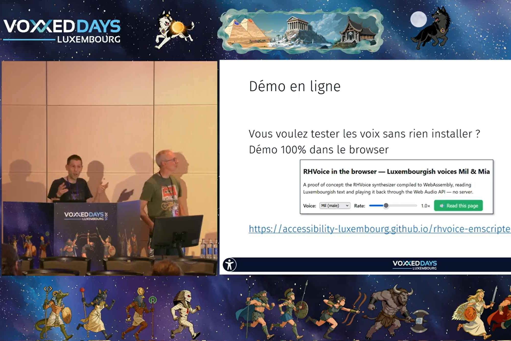

<hgroup> 
    <h1>Le SIP lève le voile sur les synthèses vocales luxembourgeoises</h1>
    
Fin juin, nous étions à nouveau présents aux VoxxedDays à Mondorf-les-Bains pour présenter Mia et Mil, les synthèses vocales luxembourgeoises adaptées aux technologies d’assistance. Retour en vidéo sur une aventure technique singulière.

</hgroup>

 
    
Quand un projet aboutit, qu’il enfante une innovation, c’est l’occasion de la faire connaître, de la laisser évoluer entre les mains des utilisateurs. Mais nous avons aussi voulu vous dévoiler les coulisses d’un chantier peu commun&#8239;: la création de voix synthétiques luxembourgeoises taillées pour l’accessibilité numérique. C’est l’objet de la présentation donnée à <a href="https://luxembourg.voxxeddays.com/en/">VoxxedDays</a> fin juin.

<figure role="group" aria-label="Présentation du SIP aux VoxxedDays, le 18 juin 2026. Capture vidéo." class="pic"> 
     
    <figcaption>Présentation du SIP aux VoxxedDays, le 18 juin 2026. Capture vidéo.</figcaption>
</figure>

Sans text to speak (TTS) luxembourgeois, jusqu’ici la meilleure solution consistait à utiliser une synthèse allemande pour lire du luxembourgeois&#8239;: un pis-aller qui, utilisé comme outil de travail quotidien, pouvait engendrer une charge cognitive supplémentaire, donc une fatigue accrue.

    

        <iframe src="https://www.youtube.com/embed/sEzu2l0CKr4" title="Lire à la volée le luxembourgeois (Dominique Nauroy , Alain Vagner) sur YouTube" allow="accelerometer; autoplay; clipboard-write; encrypted-media; gyroscope; picture-in-picture; web-share" allowfullscreen></iframe>
    

    
Lire à la volée le luxembourgeois (Dominique Nauroy , Alain Vagner)

    

        
<h3>Transcription</h3>

        
Bonjour et bienvenue. Merci d&rsquo;&ecirc;tre l&agrave;. On se pr&eacute;sente&#8239;: Alain Vagner et Dominique Nauroy. On vous pr&eacute;sente cet apr&egrave;s-midi ce qui a &eacute;t&eacute; pour nous une petite aventure technique&#8239;: la mise au point d&rsquo;une voix luxembourgeoise qui &eacute;tait adapt&eacute;e aux technologies d&rsquo;assistance utilis&eacute;es par les personnes en situation de handicap. Voil&agrave; pourquoi nous avons intitul&eacute; notre pr&eacute;sentation &laquo; Lire &agrave; la vol&eacute;e le luxembourgeois&#8239;: une innovation et un progr&egrave;s pour l&rsquo;accessibilit&eacute; &raquo;. Petite question&#8239;: y a-t-il des luxembourgophones dans la salle&#8239;? Oui&#8239;? OK, parfait, tr&egrave;s bien&#8239;: vous allez nous aider&#8239;!

        
Avant d&rsquo;aller plus loin, cette pr&eacute;sentation, vous pouvez la retrouver en ligne &agrave; cette adresse ou en scannant ce QR Code. ET si &ccedil;a a &eacute;t&eacute; trop vite, vous venez nous voir &agrave; la fin. On vous redonnera le lien.

        
D&eacute;j&agrave; on se pr&eacute;sente en deux petits mots. On travaille depuis 2020 au sein du Service information et presse du gouvernement, et plus pr&eacute;cis&eacute;ment au sein d&rsquo;une division qui est tr&egrave;s active sur l&rsquo;accessibilit&eacute; num&eacute;rique. Vous pouvez nous retrouver sur les r&eacute;seaux sociaux sous la d&eacute;nomination &laquo; Accessibility Luxembourg &raquo;.

        
Nous pouvons r&eacute;sumer ainsi nos missions&#8239;:&nbsp;

        <ul>
        <li>On contr&ocirc;le les sites et apps mobiles publics en fonction de leur accessibilit&eacute;&#8239;;</li>
        <li>On sensibilise&#8239;: on donne pas mal de formations sur le sujet, on essaie de vulgariser le sujet par la publication d&rsquo;articles sur notre portail de l&rsquo;accessibilit&eacute; num&eacute;rique&#8239;;</li>
        <li>On agit comme m&eacute;diateur entre les utilisateurs qui rencontrent des probl&egrave;mes, qui sont emp&ecirc;ch&eacute;s dans leur navigation, et les administrations</li>
        </ul>
        
Donc, on a des profils qui m&ecirc;lent un peu de d&eacute;veloppement, un peu d&rsquo;expertise en accessibilit&eacute;, un peu de p&eacute;dagogie, un peu de sens de la communication. En revanche on n&rsquo;est pas forc&eacute;ment des linguistes, et dans le projet qu&rsquo;on va d&eacute;tailler maintenant, on a un peu appris sur le tas.

        
Pour celles et ceux qui ne savent pas ou qui ne n&apos;ont pas une id&eacute;e tr&egrave;s pr&eacute;cise de ce qu&apos;est l&apos;accessibilit&eacute; num&eacute;rique au quotidien, on vous la pr&eacute;sente en deux mots parce que c&apos;est quand m&ecirc;me dans ce contexte qu&apos;a d&eacute;marr&eacute; le projet.&nbsp;

        
L&apos;accessibilit&eacute; num&eacute;rique, c&apos;est quoi&#8239;? C&apos;est en fait une discipline qui vise &agrave; garantir &agrave; tous sans discrimination un m&ecirc;me acc&egrave;s &agrave; l&apos;information et aux services en ligne. Quelle que soit la nature du handicap des personnes et la fa&ccedil;on dont chacun consulte l&apos;information. Et donc un handicap peut &ecirc;tre multiple, on peut tr&egrave;s bien &ecirc;tre aveugle, sourd, n&eacute; avec un handicap physique ou cognitif. Et il existe diff&eacute;rentes variantes ou combinaisons de ces de ces handicaps. On peut tr&egrave;s bien &ecirc;tre malvoyant ou daltonien, mais on peut aussi &ecirc;tre aveugle et sourd en m&ecirc;me temps. &Ccedil;a c&apos;est tout &agrave; fait envisageable. Et on aime bien cette la mani&egrave;re dont l&apos;OMS d&eacute;finit le handicap. Pour eux, ce n&apos;est pas uniquement une question de sant&eacute;, c&apos;est aussi un ph&eacute;nom&egrave;ne, une interaction entre les caract&eacute;ristiques corporelles d&apos;une personne et les caract&eacute;ristiques de la soci&eacute;t&eacute; o&ugrave; elle vit. Donc grosso modo, ce qu&apos;elle nous dit, c&apos;est que ce n&apos;est pas une question m&eacute;dicale uniquement, c&apos;est une question de soci&eacute;t&eacute;. Donc la soci&eacute;t&eacute;, elle doit &ecirc;tre adapt&eacute;e aux personnes handicap&eacute;es. C&apos;est &agrave; elle aussi de se rapprocher.

        
Alors ce qui va nous int&eacute;resser plus sp&eacute;cifiquement dans cette pr&eacute;sentation, c&apos;est de savoir comment aujourd&apos;hui les personnes aveugles notamment naviguent avec un smartphone ou avec un ordinateur desktop. Dans la plupart des cas, elles utilisent ce qu&apos;on appelle un lecteur d&apos;&eacute;cran, un screen reader, qui va restituer le contenu qui est affich&eacute; sur l&apos;&eacute;cran, qui va le vocaliser, qui va dire la structure d&apos;une page web par exemple et arriver &agrave; la zone de contenu, le paragraphe et va le lire.&nbsp;

        
C&apos;est ainsi que les personnes aveugles peuvent acc&eacute;der &agrave; l&apos;information et interagir sur des sites web. &Ccedil;a fonctionne de la m&ecirc;me mani&egrave;re pour des applications mobiles et il peut aussi y avoir une restitution via une plage braille pour les utilisateurs qui qui lisent le braille.

        
Quelques petits exemples de lecteurs d&apos;&eacute;cran, &ccedil;a vous dira sans doute quelque chose. Sur macOS ou iOS vous en avez un qui est VoiceOver. Vous avez Talkback sur sur Android. Sur Windows, vous avez plusieurs solutions&#8239;: NVDA qui est une solution open source gratuite, Narrator qui est le lecteur d&apos;&eacute;cran qui est propos&eacute; par d&eacute;faut par Microsoft et JAWS qui est une solution payante assez populaire aupr&egrave;s des malvoyants et des personnes aveugles.

        
Alors cette restitution vocale qu&apos;on a commenc&eacute; &agrave; &eacute;voquer, il faut qu&apos;elle soit imm&eacute;diate en fait. Il faut qu&apos;il n&apos;y ait aucun temps de latence ou qu&apos;il soit tr&egrave;s faible.&nbsp;

        
Pourquoi est-ce que c&apos;est si important cette r&eacute;activit&eacute;&#8239;? Et pourquoi m&ecirc;me elle peut primer sur la sur la qualit&eacute; audio&#8239;? Il faut imaginer que quand on est devant un &eacute;cran et qu&apos;on commence &agrave; cliquer quelque part, si &agrave; chaque fois on doit attendre 2 secondes entre le clic et la r&eacute;ception de de l&apos;action, c&apos;est tr&egrave;s rapidement un calvaire. Il faut imaginer que si votre seul canal d&apos;interaction c&apos;est la voix et que vous devez attendre &agrave; chaque fois 2 secondes &agrave; chaque action, &ccedil;a devient p&eacute;nible.&nbsp;

        
Donc voil&agrave;, la restitution vocale, comme je vous le dis, elle d&eacute;crit le contenu et la structure d&apos;une page, par exemple, les titres, les listes &agrave; point, dire s&apos;il s&apos;agit d&apos;une image, un paragraphe et cetera. Et elle va d&eacute;crire la fonction de chaque &eacute;l&eacute;ment interactif. Elle va vous dire &quot;Vous &ecirc;tes dans tel champ de formulaire, il s&apos;agit d&apos;un bouton, il s&apos;agit d&apos;un lien et cetera.&quot; Et en plus de &ccedil;a, elle doit fonctionner &agrave; tr&egrave;s haute vitesse, &agrave; des vitesses o&ugrave; nous aurions vraiment les plus grandes difficult&eacute;s &agrave; comprendre, mais &ccedil;a permet aux personnes qui utilisent les lecteurs d&apos;&eacute;cran de scanner la page un petit peu comme nous on peut on peut on peut le faire.&nbsp;

        
Et enfin et bien cette voix synth&eacute;tique doit s&apos;adapter &agrave; toutes les langues pr&eacute;sentes dans un m&ecirc;me document. Il est possible d&apos;avoir r&eacute;guli&egrave;rement plusieurs langues sur une m&ecirc;me page, surtout ici au Luxembourg et il faut syst&eacute;matiquement que la bonne voix soit utilis&eacute;e pour chaque langue. Sinon, essayez de lire de l&apos;anglais avec une prononciation fran&ccedil;aise, &ccedil;a sera compliqu&eacute;.&nbsp;

        
Et enfin cette voix doit fonctionner sans connexion &agrave; un serveur distant. C&apos;est un crit&egrave;re qui est critique pour la vie priv&eacute;e.

        
Alors, maintenant qu&apos;on a pr&eacute;sent&eacute; le cadre, on vous pr&eacute;sente quel a &eacute;t&eacute; le probl&egrave;me. Aujourd&apos;hui, on n&apos;a pas de v&eacute;ritable text to speech luxembourgeois. Jusqu&apos;ici, la meilleure solution, &ccedil;a a consist&eacute; &agrave; utiliser une synth&egrave;se allemande pour lire du luxembourgeois. Dans la plupart des cas, c&apos;&eacute;tait OK, mais c&apos;&eacute;tait quand m&ecirc;me tr&egrave;s loin d&apos;&ecirc;tre optimal.

        
Donc oui, c&apos;est frustrant, &ccedil;a peut &ecirc;tre une perte de temps et puis surtout &ccedil;a a un impact au quotidien. Si on travaille 8h par jour avec &ccedil;a, bah &ccedil;a peut &ecirc;tre la cause d&apos;une charge cognitive accrue et donc d&apos;une fatigue accrue. C&apos;est quand m&ecirc;me plus agr&eacute;able d&apos;avoir une synth&egrave;se vocale dans sa propre langue.

        
Alors la situation jusqu&apos;&agrave; cette ann&eacute;e, &agrave; quoi &ccedil;a ressemblait&#8239;? On a fait lire le m&ecirc;me article par trois synth&egrave;ses vocales et &ccedil;a va &ecirc;tre un petit peu &agrave; vous de nous dire laquelle vous semble le plus compr&eacute;hensible. On va vous lire&#8239;: c&apos;est un article qui vient de RTL. On va vous lire &agrave; chaque fois le titre et l&apos;accroche. Alors attention c&apos;est parti.

        
Alors on vous montre maintenant qui est derri&egrave;re chacune de ces voies. Le tout premier extrait, c&apos;&eacute;tait la toute premi&egrave;re synth&egrave;se luxembourgeoise et ils utilisaient eSpeak. C&apos;&eacute;tait jusqu&apos;ici la seule compatible avec les lecteurs d&apos;&eacute;cran, mais comme certains d&apos;entre vous ont pu le d&eacute;celer, la qualit&eacute; de restitution n&rsquo;&eacute;tait vraiment pas au niveau. La deuxi&egrave;me, c&apos;est comme on vous l&apos;a un petit peu d&eacute;voil&eacute;, c&apos;est un TTS allemand sous macOS&#8239;: un peu plus clair. Troisi&egrave;me extrait&#8239;: c&apos;est lu gr&acirc;ce &agrave; la synth&egrave;se vocale qui est d&eacute;velopp&eacute;e par le centre pour la langue luxembourgeoise, le ZLS. Donc l&agrave;, la qualit&eacute; est nettement meilleure. C&apos;est le moteur qui est aujourd&apos;hui utilis&eacute; notamment pour la Sproochmaschinn. Seul b&eacute;mol, dans notre cas d&apos;usage, elle n&rsquo;est pas adapt&eacute;e aux lecteurs d&apos;&eacute;crans. Et pourquoi&#8239;? Parce qu&apos;elle ne r&eacute;pond pas &agrave; plusieurs crit&egrave;res essentiels, notamment la r&eacute;activit&eacute;, l&apos;absence de de latence ou la lecture &agrave; tr&egrave;s haute vitesse. C&apos;est quand m&ecirc;me deux crit&egrave;res essentiels. Donc voil&agrave; la d&eacute;finition du probl&egrave;me dans lequel on a commenc&eacute; &agrave; nager.&nbsp;

        
Et pourquoi aussi &ccedil;a s&apos;apparente plut&ocirc;t un d&eacute;fi ce projet&#8239;? Plusieurs questions&#8239;: il fallait que ce soit interop&eacute;rable avec la grande majorit&eacute; des lecteurs d&apos;&eacute;cran qui existent aujourd&apos;hui sur le march&eacute;. Or aujourd&apos;hui, il n&rsquo;y a pas de standard qui couvre tous les OS et les screen reader pour les synth&egrave;ses vocales. Par exemple, sous Windows, vous avez un standard SAPI5 qui est largement support&eacute;, mais apr&egrave;s il convient de d&eacute;velopper des int&eacute;grations sp&eacute;cifiques pour chaque lecteur d&apos;&eacute;cran et chaque OS.&nbsp;

        
Autre point qui n&apos;est qui n&apos;est pas des plus l&eacute;gers, le luxembourgeois est consid&eacute;r&eacute; comme un low-resource language. Qu&apos;est-ce que &ccedil;a veut dire&#8239;? &Ccedil;a veut dire que la langue compte un nombre relativement peu &eacute;lev&eacute; de locuteurs compar&eacute; &agrave; d&apos;autres langues et elle suscite de la m&ecirc;me mani&egrave;re relativement peu d&apos;int&eacute;r&ecirc;t des grands &eacute;diteurs am&eacute;ricains. Voil&agrave; pourquoi aujourd&apos;hui vous n&rsquo;avez encore ni Microsoft ni Google et cetera qui ont d&eacute;velopp&eacute; une voix luxembourgeoise.&nbsp;

        
Troisi&egrave;me point&#8239;: le multilinguisme. On est dans un contexte multilingue ici au Grand-Duch&eacute;. Or, on ne peut pas travailler en silo et produire uniquement une voix purement luxembourgeoise. La voix, elle doit &ecirc;tre aussi capable de prononcer des mots de fran&ccedil;ais, d&apos;allemand sans que ce soit un souci.&nbsp;

        
Et enfin, l&apos;open source. Les grands acteurs du domaine, Microsoft, Nuance et cetera, produisent des voix mais leur code est majoritairement propri&eacute;taire. Donc, il y a quelques moteurs de voix comme eSpeak NG qui sont en open source. La qualit&eacute; est tr&egrave;s limit&eacute;e. On a vu, c&apos;&eacute;tait l&apos;extrait num&eacute;ro 1 qu&apos;on a entendu tout &agrave; l&apos;heure. La sortie est tr&egrave;s peu naturelle. Pour nous, l&apos;open source, c&apos;est un crit&egrave;re majeur parce qu&rsquo;il s&apos;agit d&apos;argent public et donc &ccedil;a doit d&eacute;boucher sur du code public.

        
Sur quoi cela a d&eacute;bouch&eacute;&#8239;? Sur deux voix qu&apos;on a appel&eacute; sobrement Mia et Mil. Voil&agrave;, c&apos;est un petit peu les attendus du projet.

        
Alors, les r&eacute;sultats de la solution d&eacute;velopp&eacute;e&#8239;: on vous propose ici une petite d&eacute;monstration des voix en utilisation sur une page web. Alors, je vous montre.

        
Moien. M&auml;in Numm ass Mil. Ech schw&auml;tzen L&euml;tzebuergesch.

        
Je parle aussi fran&ccedil;ais.&nbsp;

        
Ich kann auch ein bischen Deutsch.

        
I am the English voice, I am here to assist Mil for the English language.

        
Hallo, ech sinn d&rsquo;Mia, ech sinn d&eacute;i zweet L&euml;tzebuerger St&euml;mm vum &ldquo;Screen Reader LB&rdquo; Projet.

        
S04E06: W&eacute;i ee Saumon an der Uelzecht

        
Heading level three.

        
An den 1950er gouf hei am Land de leschte Saumon gesinn. Fr&eacute;ier konnt een d&euml;se Wanderf&euml;sch tonneweis an der Uelzecht f&auml;nken. K&eacute;int e Retour vum Saumon gel&eacute;ngen, wa L&euml;tzebuerg seng waasserpolitesch Hausaufgaben erleedegt?

        
Den Transkript vun der Episod fannt Dir hei.

        
Blank.

        
Voil&agrave;. Donc l&agrave;, on vous a montr&eacute; deux extraits. Un sur une page web sur desktop, l&apos;autre directement sur l&apos;app, donc sur t&eacute;l&eacute;phone. Il s&apos;agit de voies qui r&eacute;pondent au cahier des charges. Elles sont disponibles via une interface qui s&apos;appelle RH Voice, qu&apos;on va vous d&eacute;tailler dans les prochaines minutes. Et ce qui &eacute;tait int&eacute;ressant pour nous, c&apos;est qu&apos;elles sont interop&eacute;rables, disponibles sur cinq environnements&#8239;: mobiles (iOS et Android) et des environnements desktop (macOS, Windows, Linux).

        
Alors qui s&apos;est pench&eacute; sur le berceau&#8239;? On n&apos;a pas &eacute;t&eacute; seuls au Service information et presse &agrave; bosser dessus et sans les trois partenaires, il n&rsquo;aurait pas davantage pu voir le jour.&nbsp;

        
Donc je dirais le premier partenaire, le partenaire le plus important peut-&ecirc;tre, &ccedil;a a &eacute;t&eacute; le ZLS, qu&apos;on a d&eacute;j&agrave; &eacute;voqu&eacute;. C&apos;est quand m&ecirc;me la r&eacute;f&eacute;rence pour tout ce qui touche &agrave; la langue luxembourgeoise. Il g&egrave;re le LOD, c&apos;est le dictionnaire en ligne, le Spellchecker et la Sproochmaschinn, qu&apos;on a d&eacute;j&agrave; &eacute;voqu&eacute;e.&nbsp;

        
Par ailleurs, ce sont des champions de l&apos;open data. Toutes leurs donn&eacute;es sont disponibles sur le portal Open Data et ce sont parmi les plus r&eacute;utilis&eacute;es. Ils ont des donn&eacute;es qui nous int&eacute;ressent&#8239;: notamment la phon&eacute;tique de chaque mot &ndash; c&apos;&eacute;tait vraiment essentiel &ndash; et aussi des enregistrements de chaque mot.&nbsp;

        
D&apos;un autre c&ocirc;t&eacute;, le CDV, donc c&apos;est le centre de d&eacute;veloppement des comp&eacute;tences li&eacute;es &agrave; la vue. On ne fait pas un produit pour les aveugles sans les impliquer. Donc le CDV, c&apos;est la r&eacute;f&eacute;rence au Luxembourg, ils sont r&eacute;guli&egrave;rement impliqu&eacute;s dans des projets d&apos;innovation.&nbsp;

        
&Eacute;videmment, on peut quand m&ecirc;me citer le minist&egrave;re de la Digitalisation qui a financ&eacute; le projet. Sans argent, l&agrave; aussi pas de projet.&nbsp;

        
En r&eacute;sum&eacute;, le ZLS nous a fourni les donn&eacute;es et l&apos;expertise linguistique, ce qui nous a beaucoup aid&eacute;. Le CDV nous a fourni l&apos;expertise accessibilit&eacute; et usage ainsi surtout que le testing. On reviendra un petit peu apr&egrave;s.&nbsp;

        
Alors &agrave; l&apos;issue de l&apos;appel d&apos;offre, c&apos;est donc la solution RH Voice qu&apos;on a retenue. Pourquoi est-ce qu&apos;elle n&rsquo;a pas de r&eacute;el challenger&#8239;?&nbsp;

        
D&apos;abord, elle offre une bonne compatibilit&eacute; avec les screen readers et les OS existants. Ils &eacute;taient en cours de finalisation de portage sur MacOS et iOS. Donc pour nous, c&apos;&eacute;tait d&eacute;j&agrave; un bon crit&egrave;re de choix. Elle est compatible, elle fonctionne avec des low power devices, c&apos;est-&agrave;-dire qu&apos;on n&rsquo;a pas besoin d&apos;un processeur sp&eacute;cifique IA ou d&apos;un gros GPU avec plein de RAM pour qu&apos;elle puisse fonctionner. C&apos;est une solution open source.

        
Sa conceptrice, Olga Yakovleva, dispose d&apos;une exp&eacute;rience reconnue dans le support des low-resource languages. Donc &agrave; ce jour, il y a 22 synth&egrave;ses vocales qui ont &eacute;t&eacute; d&eacute;velopp&eacute;es. Donc voil&agrave;, le Kirghiz, le Swana etc.

        
C&apos;est &agrave; peu pr&egrave;s tout ce que je voulais vous dire. Ah oui, mais en fait pourquoi est-ce que le luxembourgeois &ccedil;a reste quand m&ecirc;me un cas particulier&#8239;? Parce que m&ecirc;me dans les langues qu&apos;on peut citer, parmi lesquels on peut aussi citer le serbe, le roumain, le slovaque, le turkm&egrave;ne etc, m&ecirc;me dans ces cas-l&agrave;, le nombre de locuteurs est quand m&ecirc;me beaucoup plus &eacute;lev&eacute; que le luxembourgeois. &Ccedil;a se compte en g&eacute;n&eacute;ral en millions.&nbsp;

        
Voil&agrave;, le but de de ce projet pour nous, c&apos;&eacute;tait vraiment de permettre aux aveugles qui parlent cette langue d&apos;avoir acc&egrave;s &agrave; une synth&egrave;se vocale de qualit&eacute;, alors que la langue n&apos;est pas support&eacute;e par les principaux OS du march&eacute;.

        
Qui a test&eacute; la solution&#8239;? On a eu deux groupes. Un groupe constitu&eacute; de personnes voyantes avec des tests en situation r&eacute;elle et des tests synth&eacute;tiques. Alors, c&apos;est quoi des tests en situation r&eacute;elle&#8239;? On a en fait g&eacute;n&eacute;r&eacute; des sons pour des articles qui sont issus des principaux sites &eacute;ditoriaux luxembourgeois, RTL, la radio 100.7 notamment. Donc il y a eu une &eacute;coute de ces enregistrements et une remont&eacute;e des mots mal prononc&eacute;s. &Ccedil;a nous a d&eacute;j&agrave; pas mal occup&eacute;s.&nbsp;

        
Et puis apr&egrave;s&#8239;: des tests synth&eacute;tiques, c&apos;est-&agrave;-dire qu&apos;on a g&eacute;n&eacute;r&eacute; des &eacute;chantillons de mots sur base de dictionnaires fran&ccedil;ais et luxembourgeois, qui ont &eacute;t&eacute; int&eacute;gr&eacute;s &agrave; la voix. Mais l&agrave; aussi, on a d&eacute;tect&eacute; des motifs de probl&egrave;mes. Ensuite, &eacute;videmment, on a impliqu&eacute; des personnes aveugles. Il y a eu des tests en situation r&eacute;elle et une beta test publique qui a eu lieu au d&eacute;but de l&apos;ann&eacute;e pendant deux mois et on l&apos;a conclue par l&apos;organisation d&apos;Install parties. &Ccedil;a a &eacute;t&eacute; un n&oelig;ud essentiel &eacute;galement parce qu&apos;on s&apos;est rendu compte que &ccedil;a pouvait &ecirc;tre une barri&egrave;re essentielle &agrave; l&apos;adoption d&apos;une innovation. C&apos;est-&agrave;-dire qu&apos;on a essay&eacute; d&apos;amener les gens &agrave; installer et configurer ces voix. C&apos;est pas forc&eacute;ment &eacute;vident comme on vous le disait en introduction.&nbsp;

        
Jusqu&apos;alors, ces personnes utilisaient un TTS allemand pour lire du luxembourgeois. M&ecirc;me si ce n&apos;&eacute;tait pas optimal, elles s&apos;&eacute;taient habitu&eacute;es &agrave; cette version d&eacute;grad&eacute;e et c&apos;est, disons, la logique du changement c&apos;est toujours quelque chose qu&apos;il ne faut pas sous-estimer dans le d&eacute;veloppement d&apos;une innovation.

        
Maintenant on va s&apos;accrocher et on va ouvrir le capot pour rentrer vraiment dans le d&eacute;tail du projet et on va vous montrer comment est-ce que nous, non linguistes, on a quand m&ecirc;me essay&eacute; de faire dialoguer technique et linguistique.&nbsp;

        
Alors on commence par faire un petit pas de c&ocirc;t&eacute; et on va vous rappeler les principales familles de synth&egrave;se vocale. Elles sont au nombre de trois. On a la concat&eacute;native, la param&eacute;trique, la neuronale.&nbsp;

        
Alors, grosso modo, la concat&eacute;native, elle fonctionne par assemblage d&apos;extraits audio de voix enregistr&eacute;es. &Ccedil;a produit des voix assez naturelles parce qu&apos;elles sont bas&eacute;es sur de vrais enregistrements, mais c&apos;est tr&egrave;s peu flexible et surtout c&apos;est difficile d&apos;ajuster le ton ou la vitesse. Or, comme je vous l&apos;ai dit r&eacute;guli&egrave;rement, les utilisateurs de lecteur d&apos;&eacute;cran vont lire en x 2, x 3, x 4, parfois m&ecirc;me x 5. Donc voil&agrave;, c&apos;est une techno qui est ancienne. Les exemples de moteurs qui l&apos;utilisent, Mbrola ou Festival par exemple, sont relativement gourmands en m&eacute;moire.&nbsp;

        
Apr&egrave;s, on a la param&eacute;trique, qui g&eacute;n&egrave;re de la parole &agrave; partir de mod&egrave;les math&eacute;matiques. Alors, des mod&egrave;les math&eacute;matiques formants ou statistiques. C&apos;est plus flexible que les concat&eacute;natives parce que notamment on peut r&eacute;gler le d&eacute;bit ou l&apos;intonation. Il y a un inconv&eacute;nient, les voies sont un peu robotiques. Donc ce sont des voix qui sont les plus frugales en termes de puissance de calcul, de m&eacute;moire ou de stockage. Alors des exemples de moteurs open source&#8239;: eSpeak ou la solution qu&rsquo;on a choisie, RH Voice. Il y a une diff&eacute;rence entre les deux. eSpeak se base sur les formants tandis que RH Voice sur un mod&egrave;le statistique qu&apos;on appelle le mod&egrave;le de Markov cach&eacute;. On y revient dans quelques minutes. RH Voice sonne donc un peu moins robotique.

        
Enfin neuronale. Les voix neuronales sont les plus naturelles. Le probl&egrave;me &ndash; toujours un inconv&eacute;nient &ndash; c&apos;est qu&rsquo;elles vont demander beaucoup plus de puissance de calcul pour fonctionner et pour certaines, la pr&eacute;sence d&apos;un GPU est incontournable. Et enfin, la r&eacute;activit&eacute; n&rsquo;est pas forc&eacute;ment toujours optimale. Alors voil&agrave;, de notre point de vue, les derniers d&eacute;veloppements de l&apos;IA ne nous aidaient pas forc&eacute;ment parce qu&apos;au vu de nos contraintes, seule la famille param&eacute;trique pouvait coller &agrave; nos besoins. C&apos;est-&agrave;-dire que c&apos;est la plus frugale, elle est flexible et elle permet de r&eacute;gler la vitesse et l&apos;intonation.&nbsp;

        
Alors, derni&egrave;re question. Pourquoi est-ce qu&apos;on n&rsquo;a pas choisi la voie du deep learning&#8239;? On voulait quelque chose de vraiment peu gourmand qui fonctionne sur un Android de 10 ans par exemple, avec peu de RAM et qui soit super r&eacute;actif. Donc on est parvenu &agrave; avoir &ccedil;a avec une techno de g&eacute;n&eacute;ration N-1. Au niveau de la puissance CPU, il faut s&apos;imaginer aussi que votre t&eacute;l&eacute;phone ou votre ordi, il ex&eacute;cute d&apos;autres t&acirc;ches que celle de restituer vocalement un contenu. Donc la voix ne doit jamais saccader. Voil&agrave; pourquoi cette famille param&eacute;trique correspondait le mieux &agrave; nos besoins sp&eacute;cifiques.

        
Pour comprendre comment &ccedil;a marche, on va &eacute;tudier le processus qui convertit du texte en parole.

        
Alors, on peut d&eacute;marrer par la source. Donc, on affiche un texte luxembourgeois dans une page web. L&agrave;, vous avez dans le navigateur Moien, m&auml;in Numm ass Mil. Bonjour, mon nom est Mil. Le navigateur, lui, il a une repr&eacute;sentation en m&eacute;moire que vous connaissez sans doute bien. C&apos;est le DOM. Ce DOM, le document object model, est synchronis&eacute; avec une autre repr&eacute;sentation en m&eacute;moire qu&apos;on appelle l&apos;accessibility tree. Cet arbre, il est ind&eacute;pendant de la techno et il va fonctionner aussi pour les applications, ce n&apos;est pas uniquement pour du HTML. Et &ccedil;a, c&apos;est l&apos;information qui va &ecirc;tre lu par le lecteur d&apos;&eacute;cran. Le lecteur d&apos;&eacute;cran ne lit pas le HTML.

        
Alors, l&apos;accessibility tree est lu par le lecteur d&apos;&eacute;cran. &Ccedil;a, on l&apos;a vu. Celui-ci, il va convertir l&apos;information dans un format qui va &ecirc;tre compr&eacute;hensible par la voix, ici &agrave; un format qu&apos;on appelle le SSML.

        
Donc, l&apos;interaction entre le lecteur d&apos;&eacute;cran et le text to speech se fait via une API standardis&eacute;e comme SAPI5 sous Windows par exemple. Alors le TTS, il n&rsquo;a aucun contr&ocirc;le sur la mani&egrave;re dont le texte est d&eacute;coup&eacute;. Par exemple en phrase ou en partie de phrase, voire m&ecirc;me en caract&egrave;res &agrave; &eacute;peler.

        
Le moteur de RH Voice convertit le texte en phon&egrave;mes, G2P. Alors on va voir dans une seconde ce qu&rsquo;est un G2P. C&apos;est un moteur qui convertit les graph&egrave;mes en phon&egrave;mes, qui sont &eacute;crits en sons. Et donc ensuite ces phon&egrave;mes sont envoy&eacute;s au mod&egrave;le statistique qui va convertir les phon&egrave;mes en sons. Donc ce qu&apos;on voit en bas de l&apos;&eacute;cran, &ccedil;a correspond en fait &agrave; la syntaxe RH Voice avec les phon&egrave;mes des voix luxembourgeoises. Voil&agrave;.&nbsp;

        
Et l&agrave; en fait Alain va vous expliquer plus en d&eacute;tails ce qui se passe entre l&apos;&eacute;tape une, donc ce qui est affich&eacute; &agrave; l&apos;&eacute;cran, et l&apos;&eacute;tape finale, ce qui est restitu&eacute; par l&apos;application.

        
Merci Dominique. Voil&agrave;. Donc ensuite on passe au mod&egrave;le statistique. Donc c&apos;est vraiment l&apos;&eacute;tape finale. Donc on a une repr&eacute;sentation texte des phon&egrave;mes. Un phon&egrave;me, c&apos;est un son. &Ccedil;a peut &ecirc;tre un E, un O, un U ou un M par exemple. Tout &ccedil;a ce sont des phon&egrave;mes. Ces phon&egrave;mes-l&agrave; vont &ecirc;tre convertis en son. Donc nous, ce qu&apos;on a fait, c&apos;est qu&apos;on a pris du ZLS des enregistrements, donc, de mots. Donc dans le dictionnaire vous avez toujours un enregistrement de chaque mot. On a pris &ccedil;a et on a pris la repr&eacute;sentation phon&eacute;tique. Et avec &ccedil;a, on a entra&icirc;n&eacute; un mod&egrave;le. Enfin, en tout cas, notre prestataire a entra&icirc;n&eacute; un mod&egrave;le. Alors, nous, on dit que c&apos;est une bo&icirc;te noire. Pourquoi c&apos;est une bo&icirc;te noire&#8239;? Tout simplement parce que s&apos;il y a un probl&egrave;me &agrave; un endroit dans le mod&egrave;le, on ne peut pas le corriger, on est oblig&eacute; de r&eacute;entra&icirc;ner.&nbsp;

        
Je vous donne un exemple. On prononce mal un mot en particulier, je ne sais pas, le mot Moien. On a un probl&egrave;me &agrave; dire Moien. Le &laquo; ien &raquo;, par exemple, la diphtongue &laquo; ien &raquo; dans le mot est mal prononc&eacute;e, on ne va pas pouvoir la corriger. On va devoir faire d&apos;autres enregistrements qui contiennent le son &laquo; ien &raquo; et on va renvoyer &ccedil;a &agrave; l&apos;entra&icirc;nement, pour avoir une nouvelle version du mod&egrave;le.&nbsp;

        
Donc voil&agrave;, le mod&egrave;le statistique param&eacute;trique, il est bas&eacute; sur une technologie qui s&apos;appelle HTS.

        
C&apos;est un projet open source qui se base sur les mod&egrave;les de Markov cach&eacute;s. Voil&agrave;, on ne va pas plus rentrer dans les d&eacute;tails. Nous, on n&rsquo;a pas beaucoup travaill&eacute; sur cette partie-l&agrave;.&nbsp;

        
Mais l&apos;&eacute;tape d&apos;avant, le grapheme to phoneme. Donc &ccedil;a c&apos;est une partie qui est int&eacute;ressante. Qu&apos;est-ce que c&apos;est&#8239;? Donc c&apos;est la partie qui va lire du texte et qui va convertir &ccedil;a en phon&egrave;mes. Donc le phon&egrave;me, c&apos;est la repr&eacute;sentation phon&eacute;tique en fait de chaque mot. Ici vous avez donc le mot &eacute;crit &laquo; cat &raquo; en anglais, le chat en anglais. On va identifier les graph&egrave;mes. Donc &ccedil;a peut &ecirc;tre une lettre &agrave; chaque fois ou des groupes de lettres. Par exemple si vous avez chien en fran&ccedil;ais le ch va &ecirc;tre un phon&egrave;me, un seul phon&egrave;me&#8239;: le son ch.

        
Donc, &laquo; cat &raquo;, vous avez trois graph&egrave;mes et ces graph&egrave;mes sont ensuite convertis en phon&egrave;mes. Donc quels sont les trois sons, vous voulez, qui constituent le mot &laquo; cat &raquo;&#8239;? Le k, le a et le t &agrave; la fin. Voil&agrave;. Donc &ccedil;a c&apos;est le G2P. On va faire &ccedil;a pour tout. Donc pour des mots, des phrases, des paragraphes de texte.&nbsp;

        
On l&apos;a impl&eacute;ment&eacute; sur base du langage FOMA. Alors, le langage FOMA, c&apos;est un langage informatique et un compilateur qui est bas&eacute; sur le principe des transducteurs.

        
Les transducteurs, ce sont des automates finis. Donc si vous avez des vieux souvenirs des &eacute;tudes sup&eacute;rieures, les automates finis, &ccedil;a va vous rappeler quelque chose, ils produisent une sortie &agrave; partir d&apos;une entr&eacute;e.

        
Je ne vais pas trop rentrer dans les d&eacute;tails de la th&eacute;orie, mais nous on prend ces transducteurs et on va les appliquer au grapheme to phoneme. Enfin, on va prendre des graph&egrave;mes et on va les convertir en phon&egrave;mes.

        
Vous avez &agrave; cette adresse le code source de notre G2P.&nbsp;

        
Donc toutes les r&egrave;gles en fait qui permettent de convertir du texte luxembourgeois en phon&egrave;mes luxembourgeois. Avec FOMA, on d&eacute;crit toutes les r&egrave;gles. Et quelles sont les r&egrave;gles qui ont &eacute;t&eacute; d&eacute;crites&#8239;?

        
Tout simplement d&eacute;j&agrave; comment est-ce qu&apos;on d&eacute;coupe une phrase en mots&#8239;? Comment est-ce qu&apos;on d&eacute;coupe par phrases&#8239;? C&apos;est quoi les caract&egrave;res qui d&eacute;limitent les phrases&#8239;? Comment est-ce qu&apos;on prononce l&apos;alphabet quand on &eacute;pelle un mot&#8239;? Comment est-ce qu&apos;on prononce les nombres&#8239;? Alors, des nombres petits, des nombres grands, des adresses, des codes postaux, tout &ccedil;a, des num&eacute;ros de t&eacute;l&eacute;phone.

        
On va g&eacute;rer aussi ben un dictionnaire. Donc, on aura un ou plusieurs dictionnaires, on va voir &ccedil;a avec la prononciation phon&eacute;tique. Donc, quand on a la prononciation phon&eacute;tique d&apos;un mot, on sait parfaitement prononcer le mot, mais on va voir qu&apos;il existe des mots d&eacute;riv&eacute;s. On ne g&egrave;re pas forc&eacute;ment tous les cas.&nbsp;

        
On a par exemple aussi les mots compos&eacute;s. Donc en luxembourgeois comme en allemand, c&apos;est assez fr&eacute;quent. On a des mots qui sont compos&eacute;s. Donc on a un pr&eacute;fixe et un suffixe qui sont coll&eacute;s entre eux. Et souvent dans le dictionnaire, on ne les a pas o&ugrave; on aura juste le suffixe ou voil&agrave;. Donc on va &ecirc;tre oblig&eacute; d&apos;essayer de d&eacute;couper le mot pour d&eacute;tecter des pr&eacute;fixes et des suffixes. Voil&agrave;. Et apr&egrave;s, on g&egrave;re aussi d&apos;autres cas comme les symboles, les emojis, l&apos;intonation&#8239;: comment est-ce qu&apos;on fait&#8239;? Est-ce qu&apos;on monte &agrave; la fin&#8239;? On descend &agrave; la fin de la phrase en fonction de si c&apos;est une question ou pas, ou d&apos;autres param&egrave;tres. Voil&agrave;.&nbsp;

        
Concr&egrave;tement, &ccedil;a ressemble &agrave; quoi du code FOMA&#8239;? Alors, il faut s&apos;imaginer un peu un syst&egrave;me de regex avec une autre syntaxe. Je vais vous montrer ici un peu un exemple. J&apos;ai pris trois mots de fran&ccedil;ais avec leur phon&eacute;tique. Donc vous avez ici &agrave; gauche le mot chat avec sa phon&eacute;tique, le mot chien avec sa phon&eacute;tique et le mot crocodile avec sa phon&eacute;tique. Voil&agrave;. Et ce qu&apos;on va faire, c&apos;est d&eacute;crire des r&egrave;gles qui vont pouvoir convertir ces mots-l&agrave; et a priori que ces mots-l&agrave; ou pas beaucoup de mots du m&ecirc;me genre parce que mes r&egrave;gles ne sont pas assez grandes. Je n&rsquo;ai pas assez de r&egrave;gles pour faire tous les mots de l&apos;alphabet. Et bien entendu en plus en fran&ccedil;ais et en luxembourgeois et dans d&apos;autres mots, ce sont des langues qui ne sont pas r&eacute;guli&egrave;res. &Ccedil;a veut dire qu&apos;il y a toujours des exceptions et c&apos;est pour &ccedil;a qu&apos;on travaille avec des dictionnaires. &Ccedil;a c&apos;est plut&ocirc;t le mode de fonctionnement quand on ne trouve pas un mot dans le dictionnaire, alors on va faire &ccedil;a. On va essayer de prononcer avec des r&egrave;gles. Voil&agrave;.&nbsp;

        
Donc qu&apos;est-ce que je fais ici&#8239;? J&apos;ai les lettres. Si j&apos;ai les lettres CH, je vais dire que c&apos;est le symbole. OK&#8239;? &Ccedil;a c&apos;est un op&eacute;rateur de composition. Donc un peu comme dans d&apos;autres langages, CSS ou autres, on peut composer des r&egrave;gles. Donc &ccedil;a c&apos;est un op&eacute;rateur de composition qui dit &quot;OK, si maintenant j&apos;ai le caract&egrave;re C tout seul, je vais le convertir dans le son K seulement s&apos;il y a une condition qui est remplie et cette condition c&apos;est&#8239;: la lettre est suivie par A, O, U ou R.&quot; Voil&agrave;.&nbsp;

        
Donc par exemple dans crocodile, on a le symbole C qui est suivi par la lettre R. Donc c&apos;est converti en le phon&egrave;me K. Voil&agrave;.&nbsp;

        
Pareil le I il est transform&eacute; en J seulement s&rsquo;il est pr&eacute;c&eacute;d&eacute; du son ch. Voil&agrave;.

        
Et &agrave; la fin ici vous avez la gestion des lettres muettes. Donc en fran&ccedil;ais on a des

        
lettres qui ne se prononcent pas &agrave; la fin des mots. Donc par exemple le crocodile ici le e on ne va pas le prononcer. Le chat, le t &agrave; la fin, on ne le prononce pas non plus. Alors, cette r&egrave;gle-l&agrave;, elle dit quoi&#8239;? Elle dit si on a un e, donc &ccedil;a c&apos;est la condition fin de mot, le caract&egrave;re et il y a plus rien apr&egrave;s, alors on renvoie z&eacute;ro. Z&eacute;ro, c&apos;est rien. Voil&agrave;. Donc &ccedil;a, ce sont des r&egrave;gles FOMA qui vont permettre de faire ces conversions-l&agrave;.&nbsp;

        
Donc c&apos;est vraiment un exemple bidon pour vous montrer le principe. Bien entendu, on ne fonctionne pas comme &ccedil;a. On va d&apos;abord passer par un dictionnaire et au pire des cas, si on n&rsquo;a trouv&eacute; le mot nulle part, on va appliquer des r&egrave;gles g&eacute;n&eacute;riques comme &ccedil;a pour prononcer quand m&ecirc;me le mot. Voil&agrave;.

        
Notre processus en cascade, il a cinq &eacute;tapes. On va d&eacute;j&agrave; lire le dictionnaire de l&apos;utilisateur. L&apos;utilisateur peut d&eacute;finir son propre dictionnaire phon&eacute;tique. Tout simplement, je ne sais pas, j&apos;ai mon propre pr&eacute;nom ou mon propre nom qui est mal prononc&eacute; par la synth&egrave;se vocale. Je peux le corriger moi-m&ecirc;me. Je cr&eacute;e mon user dictionary et dedans, je vais mettre mon nom, mon pr&eacute;nom, je ne sais pas l&apos;entreprise o&ugrave; je travaille. Voil&agrave;, parce que &ccedil;a risque d&apos;arriver dans des mails et si c&apos;est mal prononc&eacute; &agrave; chaque fois, &ccedil;a va &ecirc;tre p&eacute;nible. Ensuite, on regarde dans le dictionnaire de luxembourgeois, dans un dictionnaire de fran&ccedil;ais. On va regarder ensuite les mots compos&eacute;s. Donc, on a des listes de pr&eacute;fixes, des listes de suffixes. On va essayer de d&eacute;couper le mot pour voir si on retrouve sur des choses connues et on

        
recherche de nouveau dans les dictionnaires. Et enfin, en dernier recours, on a ces fameuses r&egrave;gles de prononciations g&eacute;n&eacute;riques qui vont lire les mots et voil&agrave;, comme si vous et moi, on d&eacute;couvre un mot qu&apos;on n&apos;a jamais entendu, on va le prononcer d&apos;une certaine mani&egrave;re. C&apos;est ce qu&apos;on va faire l&agrave;. Voil&agrave;.&nbsp;

        
Donc le G2P, on a cinq &eacute;tapes pour le luxembourgeois mais seulement deux pour l&apos;espagnol. Pourquoi&#8239;? Le luxembourgeois est une langue qui est beaucoup plus complexe. L&apos;espagnol est une langue qui est plus transparente. &Ccedil;a se lit un petit peu comme &ccedil;a se prononce &agrave; part pour des mots d&apos;origine &eacute;trang&egrave;re, on va dire. Voil&agrave;.&nbsp;

        
Donc &ccedil;a c&apos;est quelque chose qu&apos;il faut savoir. Maintenant, on a quand m&ecirc;me quelques limites avec notre approche, avec des dictionnaires etc.

        
Quelles sont ces limites&#8239;?

        
On a par exemple le fait qu&rsquo;on peut avoir un m&ecirc;me mot en luxembourgeois et en fran&ccedil;ais. Donc l&agrave;, on avait deux &eacute;tapes avec deux dictionnaires. Bien entendu, si on trouve un mot dans le dictionnaire luxembourgeois, &ccedil;a passe &agrave; la sortie, il est prononc&eacute;. Donc l&agrave;, par exemple, les mots comme an si, alors je vais les dire en fran&ccedil;ais peut-&ecirc;tre an, si vu, ville sou, rose, ils existent aussi en luxembourgeois&#8239;: an, si vu, ville sou, rose. Voil&agrave;. Donc on a ces mots qui existent dans les deux langues. Donc ce qui va se passer l&agrave;, c&apos;est que ces mots vont &ecirc;tre prononc&eacute;s &agrave; la luxembourgeoise. Donc si on a du texte en luxembourgeois, ensuite une phrase de fran&ccedil;ais avec un de ces mots l&agrave;-dedans, et bien on aura potentiellement une mauvaise prononciation. Nous, on a trouv&eacute; dans les tests que ce n&rsquo;&eacute;tait pas si grave. On arrive &agrave; comprendre quand m&ecirc;me ce que c&apos;est.&nbsp;

        
C&apos;est autre chose aussi avec les text to speech de voir un petit peu o&ugrave; est-ce qu&apos;on met la limite en fait dans la qualit&eacute; de la sortie.

        
Donc quand on a travaill&eacute; l&agrave;-dessus, on a travaill&eacute; avec des dictionnaires. Donc les dictionnaires, comme on l&apos;a dit, on a fait beaucoup de testing pour voir si c&apos;&eacute;tait prononc&eacute; correctement. On est parti du dictionnaire luxembourgeois LOD. Et dans ce dictionnaire luxembourgeois, il y a une limite, c&apos;est qu&apos;en fait vous n&rsquo;avez de la phon&eacute;tique que pour ce qu&apos;on appelle la forme canonique, la forme normale d&apos;un mot. Donc pour les adjectifs ou pour les verbes, vous n&apos;avez pas les formes d&eacute;clin&eacute;es, les formes conjugu&eacute;es, les variantes. Donc l&agrave;-dessus, nous on a d&ucirc; faire de l&apos;inf&eacute;rence, on a inf&eacute;r&eacute; toutes les variantes possibles d&apos;un verbe, toutes les conjugaisons, pareil pour toutes les autres formes de mots.&nbsp;

        
Et donc en faisant &ccedil;a, on a pu introduire des probl&egrave;mes dans la phon&eacute;tique et c&apos;est &ccedil;a qu&apos;on a v&eacute;rifi&eacute;. Donc on a pris des &eacute;chantillons, on les a &eacute;cout&eacute;s comme le disait Dominique et on a corrig&eacute; &ccedil;a.

        
Par ailleurs, on a aussi &eacute;cout&eacute; en situation r&eacute;elle des vrais articles sur RTL, sur 100.7, sur le site du gouvernement. Et en faisant &ccedil;a, on a d&eacute;tect&eacute; qu&rsquo;il y a plein de mots qui ne sont pas dans le dictionnaire tout simplement. Donc vous avez des mots pas dans le dictionnaire. Pourquoi&#8239;? Parce que ce sont des noms de marque, des noms de soci&eacute;t&eacute;, des noms de personnes, des pr&eacute;noms, tous ces choses-l&agrave;, ce sont des choses qu&apos;on n&rsquo;avait pas et qui &eacute;taient mal prononc&eacute;es. Donc l&agrave;-dessus, on a fait un peu des cycles dans lesquels on a fait des corrections, on les a test&eacute;es, on les a r&eacute;&eacute;cout&eacute;es, recorrig&eacute;es jusqu&apos;&agrave; ce qu&apos;on ait une version un peu am&eacute;lior&eacute;e.

        
Donc voil&agrave; sur la phon&eacute;tique. Alors vous avez vu d&eacute;j&agrave; quand j&apos;ai &eacute;crit en phon&eacute;tique avant, j&apos;ai utilis&eacute; la notation API. Donc en anglais c&apos;est IPA. Donc c&apos;est l&apos;alphabet international pour la phon&eacute;tique, alphabet phon&eacute;tique international API.

        
Mais je ne sais pas si vous avez vu les caract&egrave;res, ils sont quand m&ecirc;me un petit peu compliqu&eacute;s &agrave; taper au clavier. Donc l&agrave;-dessus, on utilise en fait une autre forme qui s&apos;appelle le Xampa. C&apos;est une autre &eacute;criture qui fonctionne en ASCII 7 bit. Donc pour les plus vieux d&apos;entre vous, c&apos;est quelque chose qui est connu aussi je pense, pardon. Voil&agrave;.

        
C&apos;est beaucoup plus facile, on peut le taper directement sur un clavier. Donc l&agrave; par exemple vous avez quatre mots en fran&ccedil;ais&#8239;: chat, &eacute;cole et thinking, un mot d&apos;anglais. Vous avez leur transcription en alphabet phon&eacute;tique et l&agrave; vous avez la transcription en XPA.

        
Donc on voit un peu des ressemblances mais voil&agrave;, c&apos;est un alphabet aussi &agrave; apprendre. Vous savez que par exemple le T majuscule, &ccedil;a va &ecirc;tre le son en th anglais, comme dans thinking&#8239;; si vous avez un e minuscule, vous savez que c&apos;est le &eacute;, le &eacute; ouvert et non un e. Euh voil&agrave;, donc il faut apprendre un petit peu cet alphabet-l&agrave; pour &ecirc;tre capable de saisir tous ces toutes ces transcriptions phon&eacute;tiques. &Ccedil;a, c&apos;est quelque chose qui a &eacute;t&eacute; fait dans notre &eacute;quipe.&nbsp;

        
Au niveau du d&eacute;veloppement des dictionnaires&#8239;: on a dans notre dictionnaire actuellement du lecteur d&apos;&eacute;cran de la voix luxembourgeoise, on a 68000 mots de luxembourgeois qui proviennent en grande partie du LOD, plus nos variantes. On a 244000 mots de fran&ccedil;ais qui viennent d&apos;un dictionnaire open source. Donc il y en a peut-&ecirc;tre trop mais bon, on a tout pris.&nbsp;

        
Et on a d&eacute;velopp&eacute; des vocabulaires sp&eacute;cifiques, par exemple des acronymes.

        
Quand on est au Luxembourg, quand on parle des pompiers, l&apos;organisme c&apos;est le CGDIS. On ne va pas dire CGDIS. Pour le CTIE, c&apos;est CTIE, c&apos;est pas CTI&Eacute;, par exemple. Donc l&agrave;, il y a tout un tas d&apos;acronymes o&ugrave; il y a une prononciation sp&eacute;cifique.

        
Pareil pour les pr&eacute;noms, les noms de famille. Alors, on a fait des pr&eacute;noms typiques luxembourgeois, des pr&eacute;noms fran&ccedil;ais, des pr&eacute;noms allemands, des pr&eacute;noms portugais, espagnols, italiens. On a fait des listes, on les a inclus.

        
Pareil pour les noms de famille. On a essay&eacute; de faire des top 100. Top 100 des noms de famille, top 100 des soci&eacute;t&eacute;s, top 100 des noms de c&eacute;l&eacute;brit&eacute;. On les a &eacute;cout&eacute;s et &agrave; chaque fois qu&apos;il y avait un probl&egrave;me, on a corrig&eacute; la phon&eacute;tique.

        
Voil&agrave;, donc &ccedil;a c&apos;&eacute;tait un gros boulot. On a d&eacute;velopp&eacute; aussi notre propre clavier phon&eacute;tique parce que ben le X-SAMPA, c&apos;est bien beau, mais comment on fait pour se rappeler quelle est la lettre &agrave; utiliser pour faire le son E ou le son &Eacute;&#8239;? Ce n&rsquo;&eacute;tait pas &eacute;vident. Donc voil&agrave;, on s&apos;est fait notre propre outil pour taper plus rapidement les transcriptions phon&eacute;tiques.

        
Des exemples de mots qu&apos;on a corrig&eacute;s, ici vous avez les deux premiers&#8239;: eenzeger et nogelies. Ce sont des variantes de mots et l&agrave;-dedans, notre logiciel, notre inf&eacute;rence avait cr&eacute;&eacute; des erreurs. Donc l&agrave;-dessus, on a fait des corrections et le premier niveau, c&apos;est de faire une correction phon&eacute;tique et ensuite on voyait &ccedil;a avec le prestataire pour g&eacute;n&eacute;raliser.

        
Vous avez des mots de fran&ccedil;ais aussi qui n&rsquo;&eacute;taient pas bien prononc&eacute;s. Voil&agrave;, on les a corrig&eacute;s. des pr&eacute;noms Jeannot, voil&agrave;, si on ne sait pas prononcer Jeannot, c&apos;est quand m&ecirc;me un peu dommage.

        
Le CePAS, voil&agrave; les fameux acronymes qui ont une prononciation sp&eacute;cifique qui ne sont pas lus de mani&egrave;re &eacute;pel&eacute;e C E P A S, mais CE-PASS. Des corrections comme &ccedil;a, on en a fait plusieurs milliers, je dirais.&nbsp;

        
Donc au niveau des challenges et des le&ccedil;ons, la premi&egrave;re chose, c&apos;est l&apos;anglais. Donc on a en fait dans notre contexte quand on utilise un ordinateur par exemple, on a beaucoup de mots d&apos;anglais, ces mots ne sont pas traduits. Donc la synth&egrave;se vocale, on ne va pas &agrave; chaque fois switcher. On doit &ecirc;tre capable de parler aussi l&apos;anglais correctement. Quand on a essay&eacute; de faire prendre en compte des mots d&apos;anglais avec notre mod&egrave;le statistique, les phon&egrave;mes qu&apos;on avait r&eacute;ussi &agrave; entra&icirc;ner n&apos;&eacute;taient pas suffisants pour parler un anglais suffisamment bon. Surtout qu&apos;en g&eacute;n&eacute;ral les Luxembourgeois vont bien prononcer les mots d&apos;anglais, pas comme les francophones. C&apos;est-&agrave;-dire voil&agrave;, on va essayer de prononcer &agrave; l&apos;anglaise les mots. Ce qu&apos;on a fait c&apos;est qu&apos;on s&apos;est dit&#8239;: l&agrave;, on ne va pas pouvoir r&eacute;entra&icirc;ner le mod&egrave;le, refaire des enregistrements et cetera, c&apos;est trop de travail pour notre projet. Donc on a choisi un switch automatique. C&apos;est celui que vous avez entendu au d&eacute;but dans la vid&eacute;o. Donc il y a une d&eacute;tection automatique de langue parce qu&apos;on ne peut pas toujours se baser sur le contenu pour savoir quelle est la langue d&apos;un texte.&nbsp;

        
Donc on a un switch automatique de langue dans le syst&egrave;me. On a eu pas mal de travail aussi sur les symboles et les emojis.

        
Il faut savoir qu&apos;il y a un projet qui s&apos;appelle le CLDR, qui est un projet international et qui fournit des traductions en texte, des descriptions en texte de tous les emojis dans &agrave; peu pr&egrave;s toutes les langues, y compris de luxembourgeois. Maintenant quand on a fait des tests, les gens qui ont test&eacute; &ccedil;a ont trouv&eacute; les descriptions de certains emojis un peu trop verbeuses, un peu trop longues. Malheureusement, nous on a pris le parti de ne pas corriger. Pourquoi&#8239;? Tout simplement parce que le CLDR fait une mise &agrave; jour d&apos;emoji par an et des emojis il y en a &agrave; peu pr&egrave;s 6000 voire plus. Donc c&apos;est quelque chose qui est &eacute;norme et qui est mis &agrave; jour constamment. Donc l&agrave;-dessus nous on a pris le parti de garder la base du CLDR.&nbsp;

        
Vous avez aussi les probl&egrave;mes d&apos;interop&eacute;rabilit&eacute; avec les lecteurs d&apos;&eacute;cran. On a trouv&eacute; essentiellement des bugs sur iOS. Donc il faut savoir que iOS, c&apos;est le dernier syst&egrave;me qui a permis l&apos;ouverture &agrave; des synth&egrave;ses vocales tierces partie, donc des synth&egrave;ses vocales qu&apos;on peut installer et il y a encore pas mal de bugs.&nbsp;

        
Donc on est en contact avec Apple pour corriger certaines choses. Il y a des corrections qui vont arriver dans iOS 27.

        
Donc on a vu dans la premi&egrave;re beta par exemple, ici vous avez un bug tout b&ecirc;te mais le symbole point est envoy&eacute; au text to speech sous le mot dot. Donc non traduit. En luxembourgeois, on dirait Punkt. Et l&agrave; vous recevez dot. Nous on n&apos;est pas capable de retraduire &ccedil;a derri&egrave;re. Donc on a dot. C&apos;est prononc&eacute; dot. C&apos;est &agrave; eux de corriger.&nbsp;

        
Pareil, on n&rsquo;a pas de contr&ocirc;le sur les symboles et les emojis. On va voir que c&apos;est le cas avec d&apos;autres lecteurs d&apos;&eacute;cran, avec d&apos;autres plateformes. On a des boutons qui sont lus en anglais parce que la langue luxembourgeoise n&apos;est pas reconnue par le syst&egrave;me. Elle n&rsquo;existe pas officiellement dans le syst&egrave;me. &Ccedil;a va changer aussi avec iOS 27. Par exemple, on aura le clavier en luxembourgeois.

        
Et certains textes sont aussi envoy&eacute;s au text to speech sans majuscule, ce qui peut cr&eacute;er des ambigu&iuml;t&eacute;s entre des acronymes et des mots. Donc l&agrave;-dessus, on a aussi des petits probl&egrave;mes. Donc on essaie de voir avec eux ce qu&apos;on peut faire.

        
On a aussi un autre probl&egrave;me qui est celui du switch de langue. Donc comme vous le savez peut-&ecirc;tre en HTML, il est possible de sp&eacute;cifier la langue. Donc cet attribut langue, il est hyper important parce qu&apos;il permet au lecteur d&apos;&eacute;cran de choisir automatiquement le text to speech qui va &ecirc;tre utilis&eacute; pour lire le texte. Donc si vous mettez lang=LB, &ccedil;a va &ecirc;tre lu avec une langue luxembourgeoise. Si vous mettez lang=FR, &ccedil;a va &ecirc;tre lu en fran&ccedil;ais avec une voix fran&ccedil;aise.&nbsp;

        
Le probl&egrave;me de &ccedil;a, c&apos;est que sur plusieurs OS, le switch auto n&apos;est pas reconnu parce que la langue luxembourgeoise n&apos;est pas reconnue, &ccedil;a ne fonctionne pas. Sous Windows, on a un autre probl&egrave;me, c&apos;est que le switch auto, il est limit&eacute; &agrave; un moteur de text to speech. Donc l&agrave; par exemple, RH Voice supporte le luxembourgeois mais ne supporte ni le fran&ccedil;ais ni l&apos;allemand. Donc vous n&rsquo;avez pas de switch automatique. Donc l&agrave; l&apos;utilisateur peut switcher manuellement.&nbsp;

        
On a aussi la logique de l&apos;usage. Donc nous ce qu&apos;on s&apos;est dit c&apos;est qu&rsquo;au d&eacute;but, quand on a d&eacute;marr&eacute; le projet, on pensait que les gens allaient s&apos;en servir pour lire des articles de presse sur internet, en luxembourgeois. En fait, c&apos;est pas du tout &ccedil;a. Les gens utilisent essentiellement la langue luxembourgeoise pour discuter, donc sur WhatsApp, par email etc.&nbsp;

        
Et quel est l&apos;impact&#8239;? L&apos;impact, il est li&eacute; &agrave; l&apos;orthographe. Nous, comme on se base essentiellement sur le dictionnaire, il faut &eacute;crire un luxembourgeois parfait si on veut une restitution parfaite. &Agrave; partir du moment o&ugrave; il y a une faute d&apos;orthographe, la prononciation sera moins bonne. Voil&agrave;. Donc l&agrave;-dessus, c&apos;est un truc &agrave; voir. Qu&apos;est-ce qu&apos;on fait&#8239;? Alors, est-ce qu&apos;on peut essayer d&apos;introduire des fautes d&apos;orthographe dans le dictionnaire via, je ne sais pas, un algorithme ou autre pour g&eacute;rer aussi ces cas-l&agrave; ou voil&agrave;. Donc &ccedil;a ce sont des choses &agrave; r&eacute;fl&eacute;chir.

        
La difficult&eacute; d&apos;obtenir des feedbacks &eacute;tait aussi quelque chose qu&apos;on a rencontr&eacute;. Donc on a travaill&eacute; avec le CDV pour &ecirc;tre en lien avec des personnes aveugles qui nous ont fait &eacute;norm&eacute;ment de retour. C&apos;&eacute;tait super. Et ensuite, on est pass&eacute; au b&ecirc;ta test en se disant &quot;On va ouvrir &agrave; tout le monde, n&apos;importe qui va pouvoir installer et va nous faire des retours.&quot; On s&apos;est rendu compte que ce n&rsquo;&eacute;tait pas si simple. On est dans le cadre d&apos;un processus d&apos;adoption technologique. Qu&apos;est-ce que &ccedil;a veut dire&#8239;? &Ccedil;a veut dire que les gens, ce n&rsquo;est pas parce que vous mettez un logiciel en ligne qu&apos;ils vont l&apos;utiliser, tout simplement.&nbsp;

        
Donc l&agrave;-dessus, il fallait faire de la communication, de la gestion du changement, du support, aider les gens. Voil&agrave;, ils ont un probl&egrave;me, ils n&rsquo;arrivent pas &agrave; installer. Qu&apos;est-ce qu&rsquo;ils doivent faire&#8239;? Voil&agrave;.

        
Le probl&egrave;me de la r&eacute;tribution aussi des tests utilisateurs. Il y a des utilisateurs qui nous disent &quot;Moi, je veux bien tester mais il faut payer.&quot; Voil&agrave;. Donc l&agrave;, qu&apos;est-ce qu&apos;on fait&#8239;?

        
On ne l&rsquo;avait pas pr&eacute;vu clairement. Donc &ccedil;a c&apos;est quelque chose aussi pour nos futurs projets, on pourra y r&eacute;fl&eacute;chir.

        
On a des utilisateurs satisfaits. Alors on vous a traduit la r&eacute;ponse en luxembourgeois ici. Donc les personnes trouvent les voix utiles, elles pensent l&apos;utiliser r&eacute;guli&egrave;rement.

        
Elles voient aussi une am&eacute;lioration par rapport &agrave; la voix allemande. Donc &ccedil;a, on va quand m&ecirc;me dans une bonne direction.

        
On a des retours positifs aussi sur les r&eacute;seaux sociaux. On vous en a mis quelques-uns, des gens qui travaillent dans le sujet. Voil&agrave;, donc qui nous ont dit qu&apos;ils &eacute;taient tr&egrave;s int&eacute;ress&eacute;s.

        
Un tout petit peu hors sujet, il me reste encore un tout petit peu de temps. Vous avez ici en fait ce moteur RH Voice, c&apos;est tellement l&eacute;ger, frugal qu&apos;on a r&eacute;ussi &agrave; le compiler pour qu&apos;il fonctionne dans une page web. On a utilis&eacute; le logiciel le compilateur EmScripten qui va prendre du code CC++ et qui va le convertir en ce qui s&apos;appelle du web assembly. C&apos;est un langage binaire quoi, comme un un jar en Java euh qui tourne directement dans le navigateur. Donc on arrive &agrave; avoir une fonctionnalit&eacute; offline. On peut avoir une page web qui fonctionne ensuite sans acc&egrave;s r&eacute;seau et qui est capable d&apos;utiliser les voix.

        
Donc si vous voulez sans installer tester nos voix, vous pouvez juste aller l&agrave; et puis faire quelques tests.

        
Voil&agrave;, c&apos;&eacute;tait &agrave; peu pr&egrave;s tout. Pour conclure, pour nous c&apos;&eacute;tait, en tout cas pour notre petite &eacute;quipe, on est quatre. C&apos;&eacute;tait un projet ambitieux euh qui a d&eacute;bouch&eacute; sur des r&eacute;sultats concrets avec deux voix&#8239;: une voix masculine, une voix f&eacute;minine qui fonctionnent en offline, en cross platform, open source qui sont r&eacute;actives et qui fonctionnent &agrave; haute vitesse. Donc le cahier des charges est rempli.

        
Si vous voulez regarder tout &ccedil;a un petit peu plus en d&eacute;tail, vous avez un article sur notre site qui vous donne tous les liens de t&eacute;l&eacute;chargement, comment est-ce que vous configurez &ccedil;a

        
sur votre ordinateur et tout est open source. Donc les contributions sont les bienvenues. Donc si le langage FOMA ou la phon&eacute;tique vous botte, n&apos;h&eacute;sitez pas. Voil&agrave;, c&apos;est &agrave; peu pr&egrave;s tout.&nbsp;

        
Alors merci pour votre attention et je vais laisser la parole &agrave; Mil. Merci fir &Auml;r Opmierksamkeet. Merci pour votre attention. Ciao. Bye bye.

        
Merci beaucoup. On a peut-&ecirc;tre le temps pour une ou deux questions s&apos;il y en a. Oui.

        
Merci. Merci. Merci infiniment. En fait, c&apos;est toujours agr&eacute;able de votre rencontre. J&apos;ai seulement une question par rapport &agrave; la liaison. Est-ce qu&apos;il y la notion de liaison entre les mots&#8239;? Parce que j&apos;ai l&apos;impression que &ccedil;a se base pour chaque mot mais s&apos;il y a un mot qui entre mot, est-ce que c&apos;est trait&eacute; aussi ou pas&#8239;?&nbsp;

        
Alors la liaison, on n&rsquo;a pas eu &agrave; le g&eacute;rer. En Luxembourgeois, la fa&ccedil;on dont c&apos;est &eacute;crit, on n&rsquo;avait pas besoin de g&eacute;rer la liaison. Si on impl&eacute;mentait par exemple une synth&egrave;se vocale fran&ccedil;aise, il faudrait impl&eacute;menter la r&egrave;gle de liaison, d&apos;ailleurs qui est relativement complexe. Donc l&agrave; nos lois nos voix quand elles lisent le fran&ccedil;ais, elles le lisent malheureusement sans liaison. Mais &eacute;tant donn&eacute; que c&apos;&eacute;tait une voix luxembourgeoise, le fran&ccedil;ais c&apos;est juste un backup. Voil&agrave;.&nbsp;

        
Alors moi ma question c&apos;est sur l&apos;int&eacute;gration. Je pensais b&ecirc;tement que le TTS c&apos;&eacute;tait juste un fichier &agrave; installer sur son OS. Je ne comprends pas trop quelle est la partie de l&apos;OS, la partie RH Voice et la partie de votre travail &agrave; vous.&nbsp;

        
D&rsquo;accord, &ccedil;a on peut vous expliquer en deux mots. Donc c&apos;est-&agrave;-dire dans chaque OS le text to speech c&apos;est un composant logiciel. Donc sous Windows, c&apos;est un genre de DLL, c&apos;est quelque chose comme &ccedil;a qui va s&apos;ins&eacute;rer dans le syst&egrave;me, qui va &ecirc;tre enregistr&eacute; et ensuite le syst&egrave;me a &agrave; disposition un ensemble de voix. Il peut &eacute;num&eacute;rer les voix et il peut les activer en fonction de la langue dont il a besoin. Ensuite, vous avez le lecteur d&apos;&eacute;cran qui est aussi un composant de l&apos;OS ou qui peut &ecirc;tre un logiciel install&eacute; qui va se baser sur les voix disponibles du syst&egrave;me. Et RH Voice, c&apos;est ce qu&apos;on appelle un moteur de text to speech. Donc il s&apos;int&egrave;gre avec le syst&egrave;me, donc il va &ecirc;tre compatible avec les diff&eacute;rentes API de chacun des syst&egrave;mes. Et derri&egrave;re, il va avoir &agrave; la fois la partie G2P qu&apos;on a vu l&agrave;, les r&egrave;gles de synth&egrave;se des phon&egrave;mes statistiques pour &ecirc;tre capable de g&eacute;n&eacute;rer la voix.

        
Derni&egrave;re question.

        
Est-ce que vous avez tenu compte des diff&eacute;rences r&eacute;gionales dans la prononciation du luxembourgeois parce que malheureusement il y en a.

        
C&apos;est une tr&egrave;s bonne question. On s&apos;est bas&eacute; uniquement sur les donn&eacute;es fournies par le dictionnaire LOD qui est le luxembourgeois normalis&eacute; par eux. Donc malheureusement il n&rsquo;y a pas les variantes mais vous nous donnez une id&eacute;e pour une version 2. On cherchait un &eacute;chantillon plus petit encore.

        
Merci beaucoup. Merci. Merci.

    

Nous avons donc eu à cœur de proposer des voix luxembourgeoises opérationnelles sur une majorité de plateformes (Windows, macOS, iOS, Android), open source et capables de fonctionner offline, pour garantir la vie privée des utilisateurs.

<h2>Des données de grande qualité</h2>

Mais le vrai défi d’un TTS luxembourgeois, c’est qu’il est développé en partant d’un « low-resource language », en d’autres termes une langue qui compte relativement peu de locuteurs et dont les ressources (textes disponibles en ligne, par exemple) sont moindres que pour le français, l’anglais ou l’allemand. Ici entre en scène le <a href="https://zls.gouvernement.lu/lb.html">ZLS</a> et son dictionnaire LOD, dont les données nous ont été précieuses&#8239;: chaque entrée contient en général sa phonétique, une prononciation audio du mot isolé, comme dans le contexte d’une phrase. La réutilisation de ce petit trésor était un prérequis pour le projet.

Autre acteur majeur&#8239;: le prestataire technique retenu, <a lang="en" href="https://rhvoice.org/">RHVoice</a>, qui affiche une longue expérience des « low-resource languages » et qui développe des synthèses vocales peu gourmandes en puissance de calcul, critère essentiel pour assurer une restitution avec un très faible temps de latence mais aussi à haute vitesse, deux qualités incontournables pour les TTS dédiés à l’accessibilité.

Le multilinguisme constituait un autre écueil&#8239;: nos voix devaient pouvoir prononcer des mots de français et d’allemand, ce qui n’a rien d’évident quand deux mots sont identiques en luxembourgeois et en français, comme&#8239;: an, si, vu, ville, sou, rose.

La détection automatique de la langue dans une phrase permet par exemple de basculer vers une voix anglaise à partir d’un certain seuil. De plus, sur une page web, l’attribut lang permet de spécifier manuellement dans quelle langue est encodé un extrait de phrase, ce qui assure théoriquement une prononciation toujours compréhensible. Cependant, sous Windows cela ne fonctionne qu’entre les langues supportées par le moteur de synthèse vocale, et sous d’autres OS, ce switch ne fonctionne pas car la langue luxembourgeoise n’est pas (encore) reconnue.

<h2>Fine tuning&#8239;: on sait quand ça commence...</h2>

Pendant le projet, nous avons acquis quelques notions de linguistique, notamment pour enrichir le dictionnaire à la suite des tests effectués au <a href="https://www.cc-cdv.lu/fr">CDV</a>, qui a collecté des tests en situation réelle. À la suite de ces retours, nous avons traduit en phonèmes les graphèmes (les mots écrits) afin d’améliorer leur restitution vocale. Les cas ici ont été multiples&#8239;: verbes conjugués (le LOD ne propose pas d’enregistrement audio pour chaque conjugaison)&#8239;; acronymes (C-G-DIS)&#8239;; noms de famille ou de société, etc.

Par ailleurs, le projet a consisté à faire dialoguer différents systèmes entre eux, notamment entre le TTS et le lecteur d’écran (JAWS, NVDA, VoiceOver ou Talkback). Avec là aussi quelques chausse-trapes&#8239;: certains bugs sous iOS, indépendants de notre volonté, peuvent être gênants (à titre d’exemple, le point est systématiquement lu « dot » en anglais en dépit d’un contexte de document ou de paragraphe en luxembourgeois). Autre cas de figure&#8239;: les symboles et emojis sont traités par un organisme international, le <a href="https://cldr.unicode.org/">CLDR</a>, et c’est une nouvelle passerelle qu’il faut établir pour proposer les corrections de certaines traductions luxembourgeoises qui nous semblent parfois alambiquées.

<h2>L’adoption et le détournement de l’usage</h2>

Nous avions pensé à l’origine que ce TTS aiderait à restituer des articles sur des pages web en luxembourgeois. Or le principal usage est surtout actif, dans la discussion par courriel ou WhatsApp. Dans ces échanges, la qualité de l’orthographe est moindre, ce qui n’est pas sans conséquence sur la prononciation.

Mais surtout, il ne suffit pas de publier une technologie pour qu’on se l’approprie immédiatement. Il faut communiquer, gérer le changement, aider les gens à installer, assurer un support. Tout cela prend du temps, plus que ce que nous avions prévu.

Le projet s’est étalé sur un an&#8239;: un peu court pour des objectifs clairement ambitieux et une participation dans un projet dont nous n’avions pas pleinement estimé l’ampleur. Pour autant, Mia et Mil existent, ils ont reçu un accueil très positif. Ils vont continuer à grandir et c’est une fierté pour le SIP de les avoir portés en ligne. Vous aussi, vous êtes invités à vous les approprier, <a href="https://accessibilite.public.lu/fr/news/2026-03-30-screenreaderLB.html">en commençant par les écouter sur cette page</a>.

<aside class="more">
    <h2>En savoir plus</h2>
    <ul>
        <li><a href="https://accessibilite.public.lu/docs/voxxed2026/voxxeddays.pdf">La présentation au format PDF (1.6 Mo)</a></li>
        <li><a href="https://accessibilite.public.lu/docs/voxxed2026/verbatim.html">Le verbatim initial au format HTML</a></li>
    </ul>
</aside>